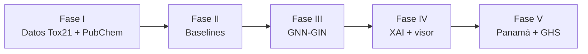
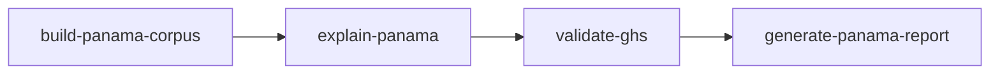

# Predicción de Toxicidad de Agroquímicos — GNN-GIN, XAI y Analítica ChEMBL

Repositorio con **dos líneas de trabajo** complementarias sobre toxicidad de plaguicidas usados en Panamá:

1. **JIC 2026 — Sistema GNN-GIN + XAI sobre Tox21.** Química computacional que modela moléculas como **grafos** (átomos = nodos, enlaces = aristas), entrena una **GNN tipo GIN** sobre el benchmark **Tox21** (12 tareas de toxicidad) e incorpora **explicabilidad** (GNNExplainer, Grad-CAM) para identificar qué grupos funcionales causan la toxicidad predicha.
2. **Proyecto Análisis de Datos — ChEMBL × Plaguicidas Panamá** (carpeta [`proyecto analisis/`](proyecto%20analisis/)). Ciencia de datos clásica sobre bioactividad ChEMBL del MIDA: extracción SQLite/API, EDA descriptivo, multivariado e inferencia (107 compuestos). **Proyecto separado** con su propio `src/`, `data/`, `notebooks/`, `outputs/` y visor FastAPI (puerto 8001).

El **visor GNN** (3D + XAI) vive en `viz/` en la raíz del monorepo. El dashboard ChEMBL está en `proyecto analisis/viz/`.

---

## Estructura del repositorio

```
JIC2026/
├── config/
│   └── config.yaml                       # Hiperparámetros del modelo y entrenamiento
│
├── src/                                  # Código fuente compartido
│   ├── data/
│   │   ├── featurizer.py                 # SMILES → grafo PyG (45 feat. átomo, 9 feat. enlace)
│   │   ├── dataset.py                    # ToxicityDataset + TASK_NAMES (12 tareas Tox21)
│   │   ├── splitter.py                   # Scaffold split de Murcko
│   │   ├── tox21_deepchem.py             # Carga Tox21 desde DeepChem
│   │   └── pubchem_api.py                # Cliente PubChem (BioAssay, Compound, GHS)
│   ├── models/
│   │   ├── gin.py                        # GNN-GIN (GINEConv + residual + multitarea)
│   │   └── baselines.py                  # RF, MLP, SMILES2vec
│   ├── training/
│   │   ├── trainer.py                    # Loop con early stopping y CV scaffold
│   │   ├── loss.py                       # MaskedBCELoss (ignora NaN + pos_weight)
│   │   ├── schedulers.py                 # Cosine+warmup o ReduceLROnPlateau
│   │   ├── checkpoint.py                 # Selección del mejor modelo
│   │   └── metrics.py                    # Re-exporta métricas de evaluación
│   ├── xai/
│   │   ├── gnn_explainer.py              # GNNExplainer con _SingleTaskWrapper
│   │   ├── grad_cam.py                   # Grad-CAM adaptado a grafos
│   │   └── visualizer.py                 # SVG + colores hex YlOrRd (2D y 3D)
│   └── evaluation/
│       ├── cross_validation.py           # AUC-ROC/AUPRC multitarea + folds scaffold
│       └── chemical_coherence.py         # Validación XAI con patrones SMARTS
│
├── proyecto analisis/                      # Proyecto Análisis de Datos (SEPARADO)
│   ├── README.md
│   ├── config/config.yaml                # ChEMBL + viz analytics
│   ├── src/analisis_proyecto/            # Pipeline ChEMBL
│   ├── data/                             # raw / processed / external/chembl
│   ├── notebooks/                        # Fases 1–7 + anexo baseline
│   ├── docs/fases/
│   ├── outputs/chembl/ + outputs/dashboard/
│   ├── scripts/                          # CLI por fase
│   └── viz/                              # FastAPI analytics (puerto 8001)
│
├── viz/                                  # Visor GNN 3D + XAI (JIC, puerto 8000)
│   ├── app.py
│   ├── config.py                         # Rutas GNN, TASK_NAMES, host/port
│   ├── routes/
│   │   ├── views.py                      # Visor 3D (HTML)
│   │   └── api.py                        # REST GNN: predict/explain/mol3d/svg
│   ├── services/
│   │   ├── inference.py                  # Modelo GIN cargado en memoria
│   │   ├── molecule.py                   # SMILES → SDF 3D, propiedades RDKit
│   │   ├── corpus.py                     # Corpus precomputado (viz/data/*.json)
│   │   └── dashboard/xai.py              # Resolución SVGs XAI (GNN)
│   ├── templates/                        # Jinja2: visor 3D
│   ├── static/                           # CSS, JS (3Dmol.js)
│   └── data/                             # Corpus JSON precomputado
│
├── scripts/                              # Pipelines CLI (solo JIC / GNN)
│   ├── fase1/                            # Tox21 → grafos
│   ├── fase2/                            # Baselines (RF, MLP, SMILES2vec)
│   ├── fase3/                            # Entrenamiento GIN + 5-fold CV
│   ├── fase4/                            # Visor (build_viz_corpus, viz_serve)
│   └── fase5/                            # Corpus Panamá, XAI, reportes GNN
│
├── notebooks/                            # Notebooks JIC (Tox21, GIN, Panamá, GHS)
│   ├── 01_eda_tox21.ipynb
│   ├── 02_baselines_tox21.ipynb
│   ├── 04_gnn_training.ipynb
│   ├── 06_panama_application.ipynb
│   └── 07_ghs_validation.ipynb
│
├── docs/                                 # Documentación Parte 1 (JIC)
│   ├── fase1_pipeline_datos.md
│   ├── fase2_baselines.md
│   ├── fase3_modelo_gin.md
│   ├── fase4_xai.md
│   └── fase5_panama.md
│
├── mateo_docs/                            # Documentación interna / personal (Mateo)
│   ├── auditorias/                        # Auditoría del proyecto y referencias de métricas
│   │   ├── AUDIT_REPORT.md
│   │   └── METRICAS_EVALUACION.md
│   └── planes/                            # Planes y hojas de ruta
│       └── EXPANSION_CHEMBL_PLAN.md
│
├── tests/                                # pytest: loss, splitter, cross_validation
├── data/                                 # Datos crudos y procesados (no en git)
├── outputs/                              # Modelos, resultados, gráficos (no en git)
├── Makefile                              # Comandos de pipeline
├── CLAUDE.md                             # Planificación detallada del proyecto
└── README.md                             # Este archivo
```

---

## Setup común

### 1. Dependencias

```bash
# Crear entorno (Python 3.10–3.12; deepchem no soporta 3.13+)
conda create -n toxgnn python=3.10
conda activate toxgnn
conda install -c conda-forge rdkit

# PyTorch con soporte GPU (CUDA 12.4)
pip install torch torchvision torchaudio --index-url https://download.pytorch.org/whl/cu124

# PyTorch Geometric (ajusta la URL si usas otra versión CUDA)
pip install torch_geometric torch_scatter torch_sparse torch_cluster \
  -f https://data.pyg.org/whl/torch-2.6.0+cu124.html

pip install -r requirements.txt
```

Alternativa con Makefile (venv local en `.venv/`):

```bash
make setup
.venv\Scripts\pip install torch torchvision torchaudio --index-url https://download.pytorch.org/whl/cu124
make install-pyg-ext
```

Verificar GPU:

```bash
make check-gin-gpu
# o: python -c "import torch; print('CUDA:', torch.cuda.is_available())"
```

### 2. Tests

```bash
pytest
```

---

# Parte 1 — JIC 2026 · GNN-GIN + XAI sobre Tox21

Sistema de química computacional con explicabilidad orientado a evaluar el perfil toxicológico de plaguicidas registrados en el MIDA de Panamá.

## Idea central

| Aspecto | Detalle |
|---|---|
| **Problema** | Evaluar el perfil de toxicidad multitarea de plaguicidas sin depender solo de ensayos costosos |
| **Enfoque** | Grafo molecular + GIN (mensajes agregados con suma) + readout mean+max + cabeza multitarea (12 salidas) |
| **Datos** | Tox21 vía DeepChem (~8000 moléculas, 12 ensayos biológicos, datos faltantes con `MaskedBCELoss`) |
| **Split** | Scaffold de Murcko (sin filtración entre train/test) |
| **Baselines** | Random Forest, MLP, SMILES2vec — misma evaluación para comparación justa |
| **XAI** | GNNExplainer + Grad-CAM; colores YlOrRd unificados en SVG 2D y modelo 3D |
| **Visor web** | Dashboard FastAPI con corpus panameño, inferencia en vivo y visualización 3D/2D |
| **Objetivo** | AUC-ROC medio > 0.82 en test con scaffold split |

**Hipótesis:** Una GNN-GIN entrenada en grafos Tox21 predice el perfil de toxicidad de plaguicidas panameños con AUC-ROC superior a modelos QSAR clásicos, y las explicaciones XAI identifican grupos funcionales coherentes con mecanismos documentados.

## Las 5 fases



| Fase | Descripción | Documentación |
|---|---|---|
| I | Pipeline de datos: SMILES → grafos, scaffold split, corpus panameño | [docs/fase1_pipeline_datos.md](docs/fase1_pipeline_datos.md) |
| II | Baselines: RF, MLP, SMILES2vec como referencia | [docs/fase2_baselines.md](docs/fase2_baselines.md) |
| III | Modelo GNN-GIN: arquitectura, entrenamiento, evaluación | [docs/fase3_modelo_gin.md](docs/fase3_modelo_gin.md) |
| IV | XAI: GNNExplainer, Grad-CAM, validación química, visor web | [docs/fase4_xai.md](docs/fase4_xai.md) |
| V | Aplicación a plaguicidas de Panamá, reportes MIDA/MINSA | [docs/fase5_panama.md](docs/fase5_panama.md) |

## Pipeline de entrenamiento

### 1. Preparar grafos Tox21

```bash
make prepare-graphs
# = python scripts/fase1/prepare_tox21_graphs.py
```

Genera `data/processed/graphs_{train,val,test}.pt` a partir de Tox21 (DeepChem).

### 2. Entrenar baselines (Fase II)

```bash
make train-baselines
make train-baselines-verbose    # modo verbose
```

Resultados en `outputs/results/baseline_results.csv` y gráficos en `outputs/baselines/`.

### 3. Entrenar GNN-GIN (Fase III)

```bash
make train-gin                  # entrenamiento estándar
make train-gin-verbose          # logs detallados
make train-gin-wandb            # logging con Weights & Biases
make train-gin-all              # prepare-graphs + train-gin
make train-gin-cv               # 5-fold cross-validation scaffold (AUDIT E2)
```

Guarda el mejor modelo en `outputs/models/best_gin_model.pt` y métricas en `outputs/results/gin_results.csv`.

### 4. Análisis exploratorio

```bash
make eda
# o abrir notebooks/01_eda_tox21.ipynb y notebooks/02_baselines_tox21.ipynb
```

### 5. Aplicación a Panamá (Fase V)

Requiere modelo entrenado (`make train-gin`) y corpus PubChem:



```bash
make panama-all
```

Opciones útiles:

```bash
make build-panama-corpus-fast                            # sin descarga GHS
python scripts/fase5/explain_panama.py --skip-xai        # solo predicciones
python scripts/fase5/explain_panama.py --xai-mida-only   # XAI solo en 20 MIDA
```

Si un compuesto del corpus tiene SMILES atómico o GNNExplainer falla, el pipeline imprime `[WARN]`/`[SKIP]` y sigue con los demás (no detiene `make explain-panama`). Documentación de extracción PubChem y validación GHS en [docs/fase5_panama.md](docs/fase5_panama.md).

## Configuración (`config/config.yaml`)

| Parámetro | Default | Descripción |
|---|---|---|
| `model.hidden_dim` | 128 | Dimensión oculta de las capas GIN |
| `model.n_layers` | 3 | Capas de message passing |
| `model.dropout` | 0.3 | Regularización |
| `training.lr` | 0.001 | Learning rate |
| `training.early_stopping_patience` | 50 | Épocas sin mejora antes de parar |
| `training.model_save_path` | `outputs/models/best_gin_model.pt` | Checkpoint del mejor modelo |
| `evaluation.n_folds` | 5 | Folds para cross-validation |

## Convenciones importantes (Parte 1)

- **Scaffold split obligatorio** — nunca usar split aleatorio para comparar con literatura.
- **NaN manejados con máscara** — no tratar NaN como ceros.
- **`TASK_NAMES`** definido una sola vez en `src/data/dataset.py` (replicado en `viz/config.py` para que el visor no dependa de torch_geometric — ver AUDIT P5).
- **PubChem API**: respetar rate limit (`time.sleep` entre peticiones).
- **GINEConv** (no GINConv): el modelo usa features de enlaces.
- **Corpus demo**: archivos con `"demo": true` son simulados; el visor muestra avisos explícitos.
- **Colores XAI**: generados en `src/xai/visualizer.py` con matplotlib YlOrRd; el 3D usa los mismos hex que el SVG.
- **XAI batch resiliente**: `explain_panama.py` omite SVG/importancias desalineadas (`[SKIP]`) y continúa con el resto del corpus.

## Salidas generadas (Parte 1)

| Ruta | Contenido |
|---|---|
| `data/processed/graphs_*.pt` | Grafos moleculares Tox21 |
| `outputs/models/best_gin_model.pt` | Mejor checkpoint GIN |
| `outputs/results/baseline_results.csv` | AUC por tarea — baselines |
| `outputs/results/gin_results.csv` | AUC por tarea — GNN-GIN |
| `outputs/results/gin_cv_summary.csv` | Resultado 5-fold CV scaffold |
| `outputs/eda/`, `outputs/baselines/` | Gráficos EDA y comparación |
| `data/raw/pubchem_panama_cids.csv` | Corpus panameño (CID, SMILES, familia) |
| `data/raw/pubchem_ghs_labels.csv` | Etiquetas GHS por CID (validación externa) |
| `data/processed/panama_corpus.pt` | Grafos PyG del corpus panameño |
| `outputs/results/panama_predictions.csv` | Predicciones multitarea Fase V |
| `outputs/reports/ghs_validation.csv` | Correlación predicción vs GHS |
| `outputs/reports/report_mida_minsa.pdf` | Reporte institucional |
| `outputs/xai/explanations/*.json` | Explicaciones XAI por compuesto |
| `outputs/xai/figures/*.svg` | Moléculas coloreadas por importancia |

---

# Parte 2 — Proyecto de Análisis de Datos · ChEMBL × Plaguicidas Panamá

Proyecto **autocontenido** en [`proyecto analisis/`](proyecto%20analisis/). Incluye su propio código (`src/analisis_proyecto/`), datos, notebooks (fases 1–7 + anexo), documentación (`docs/fases/`), scripts CLI, outputs y visor FastAPI de analytics (puerto **8001**).

```bash
cd "proyecto analisis"
pip install -r requirements.txt
make chembl-extract          # o: python scripts/fase1/extract_chembl_local.py
jupyter notebook notebooks/fase1_adquisicion.ipynb
python scripts/fase4/verify_flow_b.py
make prepare-dashboard && python viz/app.py   # http://127.0.0.1:8001
```

Documentación completa, RACI y comandos por fase: [`proyecto analisis/README.md`](proyecto%20analisis/README.md).

Desde la raíz del monorepo también puedes usar `make analisis-verify` y `make analisis-viz`.

---

# Visor web — GNN-Tox Viewer (JIC)

Dashboard FastAPI para explorar toxicidad molecular con explicabilidad integrada (3D + XAI). **No incluye** la analítica ChEMBL — esa vive en `proyecto analisis/viz/` (puerto 8001).

## Arranque

**Sin modelo entrenado** (corpus demo con predicciones simuladas):

```bash
make setup-viz    # instala deps FastAPI + genera corpus demo
make viz          # http://127.0.0.1:8000
```

**Con modelo entrenado** (predicciones y XAI reales):

```bash
make train-gin
make setup-viz-full    # corpus con inferencia real
make viz
```

Comandos adicionales:

```bash
make viz VIZ_PORT=8765   # puerto personalizado
make viz-lan             # accesible en la red local (0.0.0.0)
make viz-prod            # sin auto-reload (presentaciones)
make build-viz-corpus-demo   # solo regenerar JSON demo
make build-viz-corpus        # solo regenerar con modelo real
```

## Páginas (visor GNN, puerto 8000)

| Ruta | Descripción |
|---|---|
| `/` | Visor 3D del corpus precomputado (filtros por riesgo/familia) |
| `/molecule/{id}` | Vista detallada 3D + 2D + XAI de un compuesto |
| `/analyze?smiles=...` | Análisis ad-hoc de un SMILES arbitrario |
| `/health` | Health check para despliegue cloud |

> Rutas ChEMBL (`/eda`, `/chembl/models`, `/panama/map`, etc.) están en **`proyecto analisis/viz/`** (puerto 8001). Ver [`proyecto analisis/README.md`](proyecto%20analisis/README.md).

## Funcionalidades del visor 3D

| Función | Descripción |
|---|---|
| **Corpus Panamá** | Plaguicidas pre-cargados (clorpirifos, atrazina, tebuconazol, etc.) |
| **Análisis en vivo** | Predicción + XAI sobre cualquier SMILES válido (requiere modelo) |
| **Visor 3D** | Estructura molecular interactiva con [3Dmol.js](https://3dmol.csb.pitt.edu/) |
| **Visor 2D** | SVG RDKit coloreado por importancia XAI (paleta YlOrRd) |
| **Coloración unificada** | Mismos colores hex en 3D y 2D, calculados en servidor |
| **Grad-CAM / GNNExplainer** | Selector de método y diana biológica Tox21 |
| **Tabla de átomos** | Importancia por átomo con hover sincronizado al 3D |
| **Propiedades** | Peso molecular, LogP, TPSA, fórmula (RDKit) |

## API REST

### Visor GNN (`/api/...`)

| Endpoint | Método | Descripción |
|---|---|---|
| `/api/status` | GET | Estado del modelo y corpus |
| `/api/corpus` | GET | Lista de compuestos pre-computados |
| `/api/corpus/{id}` | GET | Datos completos de un compuesto |
| `/api/predict` | POST | Predicción multitarea sobre SMILES |
| `/api/explain` | POST | Explicación XAI (gradcam o gnnexplainer) |
| `/api/analyze` | POST | Predicción + XAI completo |
| `/api/mol3d` | GET | Estructura 3D (SDF) desde SMILES |
| `/api/properties` | GET | Propiedades fisicoquímicas |
| `/api/svg` | POST | SVG 2D coloreado + `atom_colors` |
| `/api/xai-colors` | POST | Colores hex YlOrRd para un vector de importancias |
| `/api/tasks` | GET | Lista de tareas Tox21 con descripciones |

> Endpoints `/api/analytics/...` (ChEMBL, geo, modelos sklearn) están en **`proyecto analisis/viz/`**.

## Generar corpus precomputado

```bash
python scripts/fase4/build_viz_corpus.py --demo    # sin modelo (UI de prueba)
python scripts/fase4/build_viz_corpus.py           # con outputs/models/best_gin_model.pt
```

Cada compuesto se guarda en `viz/data/{id}.json` con predicciones, importancias XAI, colores por átomo, propiedades y estructura 3D.

> **Nota:** Los compuestos marcados como **«Ejemplo de prueba»** en el dashboard usan datos simulados (`demo: true`). No son predicciones del modelo entrenado.

---

## Comandos Makefile (referencia rápida)

### Setup y entrenamiento (Parte 1)

| Comando | Descripción |
|---|---|
| `make setup` | Crea venv e instala `requirements.txt` |
| `make install-pyg-ext` | Extensiones PyG aceleradas (torch-scatter, etc.) |
| `make check-gin-gpu` | Verifica disponibilidad CUDA |
| `make prepare-graphs` | Genera grafos Tox21 |
| `make train-baselines` | Entrena modelos de referencia |
| `make train-gin` | Entrena GNN-GIN |
| `make train-gin-cv` | 5-fold CV scaffold (AUDIT E2) |
| `make train-gin-all` | Grafos + entrenamiento GIN |
| `make eda` | Ejecuta notebook EDA |

### Aplicación Panamá (Parte 1, Fase V)

| Comando | Descripción |
|---|---|
| `make build-panama-corpus` | Corpus Panamá desde PubChem + GHS |
| `make build-panama-corpus-fast` | Corpus sin descarga GHS |
| `make explain-panama` | Predicciones + XAI sobre corpus panameño |
| `make validate-ghs` | Correlación predicciones vs GHS |
| `make generate-panama-report` | Reporte MIDA/MINSA |
| `make panama-all` | Pipeline Fase V completo |

### Analítica ChEMBL (Parte 2)

| Comando | Descripción |
|---|---|
| `make chembl-extract` | Extracción ChEMBL (SQLite o API según config) |
| `make test-chembl-flow-b` | Verificación end-to-end Flujo B + entrenamiento RF/SVM/SVR |
| `make prepare-dashboard` | Genera artefactos JSON para el dashboard |
| `make download-geodata` | Descarga distritos Panamá + tabla INEC |

### Visor web (común)

| Comando | Descripción |
|---|---|
| `make setup-viz` | Visor: deps + corpus demo |
| `make setup-viz-full` | Visor: deps + corpus con modelo real |
| `make viz` | Arranca servidor en http://127.0.0.1:8000 |
| `make viz-lan` | Servidor accesible en red local |
| `make viz-prod` | Sin auto-reload (presentaciones) |
| `make viz-check` | Smoke test de la aplicación FastAPI |
| `make build-viz-corpus` | Regenera corpus con modelo real |
| `make build-viz-corpus-demo` | Regenera corpus con datos demo |

---

## Licencia y contexto

Proyecto de investigación para **JIC 2026** (Jornada de Iniciación Científica) y para el **proyecto de Análisis de Datos** del curso, ambos sobre el dominio de toxicidad de plaguicidas registrados por el MIDA de Panamá. Las predicciones son herramientas de priorización e investigación, **no sustituyen** evaluación toxicológica oficial. Los datos sociodemográficos mostrados en el mapa de Panamá son estimaciones reproducibles construidas a partir del área y promedios provinciales referenciados al INEC; no son datos oficiales descargados de MAPI (ver disclaimer en `/panama/map` y AUDIT P6).
