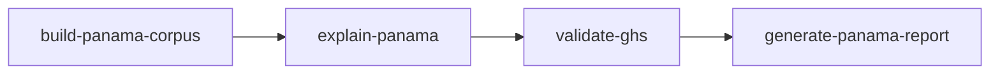
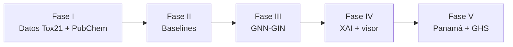

# Predicción de Toxicidad de Agroquímicos con GNN-GIN y XAI

Sistema de **química computacional** que modela moléculas como **grafos** (átomos = nodos, enlaces = aristas), entrena una **GNN tipo GIN** sobre el benchmark **Tox21** (12 tareas de toxicidad) e incorpora **explicabilidad** (GNNExplainer, Grad-CAM) para identificar qué grupos funcionales causan la toxicidad predicha. Incluye un **visor web interactivo** (FastAPI + 3Dmol.js) para explorar predicciones y explicaciones XAI sobre plaguicidas de interés en Panamá (MIDA/MINSA).

---

## Idea central

| Aspecto | Detalle |
|---|---|
| **Problema** | Evaluar el perfil de toxicidad multitarea de plaguicidas sin depender solo de ensayos costosos |
| **Enfoque** | Grafo molecular + GIN (mensajes agregados con suma) + readout mean+max + cabeza multitarea (12 salidas) |
| **Datos** | Tox21 vía DeepChem (~8000 moléculas, 12 ensayos biológicos, datos faltantes con `MaskedBCELoss`) |
| **Split** | Scaffold de Murcko (sin filtración entre train/test) |
| **Baselines** | Random Forest, MLP, SMILES2vec — misma evaluación para comparación justa |
| **XAI** | GNNExplainer + Grad-CAM; colores YlOrRd unificados en SVG 2D y modelo 3D |
| **Visor web** | Dashboard FastAPI con corpus panameño, inferencia en vivo y visualización 3D/2D |
| **Objetivo** | AUC-ROC medio > 0.82 en test con scaffold split |

**Hipótesis:** Una GNN-GIN entrenada en grafos Tox21 predice el perfil de toxicidad de plaguicidas panameños con AUC-ROC superior a modelos QSAR clásicos, y las explicaciones XAI identifican grupos funcionales coherentes con mecanismos documentados.

---

## Estructura del repositorio

```
JIC2026/
├── config/
│   └── config.yaml                 # Hiperparámetros del modelo y entrenamiento
│
├── src/
│   ├── data/
│   │   ├── featurizer.py           # SMILES → grafo PyG (45 node features, 9 edge features)
│   │   ├── dataset.py              # ToxicityDataset + TASK_NAMES (12 tareas)
│   │   ├── splitter.py             # Scaffold split de Murcko
│   │   ├── tox21_deepchem.py       # Carga Tox21 desde DeepChem
│   │   └── pubchem_api.py          # Cliente PubChem API (corpus panameño)
│   ├── models/
│   │   ├── gin.py                  # Arquitectura GNN-GIN (GINEConv + residual)
│   │   └── baselines.py            # RF, MLP, SMILES2vec
│   ├── training/
│   │   ├── trainer.py              # Loop de entrenamiento con early stopping
│   │   ├── loss.py                 # MaskedBCELoss (ignora NaN + pos_weight)
│   │   └── metrics.py              # Re-exporta métricas de evaluación
│   ├── xai/
│   │   ├── gnn_explainer.py        # GNNExplainer con _SingleTaskWrapper
│   │   ├── grad_cam.py             # Grad-CAM adaptado a grafos
│   │   └── visualizer.py           # SVG + colores hex YlOrRd (2D y 3D)
│   └── evaluation/
│       ├── cross_validation.py     # AUC-ROC/AUPRC multitarea + scaffold folds
│       └── chemical_coherence.py   # Validación de XAI con patrones SMARTS
│
├── viz/                            # Visor web interactivo (FastAPI, independiente del entrenamiento)
│   ├── app.py                      # Aplicación FastAPI
│   ├── config.py                   # Rutas, tareas Tox21, paths del modelo
│   ├── routes/
│   │   ├── api.py                  # REST: predict, explain, mol3d, svg, corpus
│   │   └── views.py                # Páginas HTML (Jinja2)
│   ├── services/
│   │   ├── inference.py            # Carga del modelo GIN + predicción/XAI en vivo
│   │   ├── corpus.py               # Corpus pre-computado (viz/data/*.json)
│   │   └── molecule.py             # SMILES → SDF 3D, propiedades RDKit
│   ├── templates/
│   │   ├── base.html
│   │   ├── index.html              # Dashboard del corpus
│   │   └── molecule.html           # Vista detallada 3D + 2D + XAI
│   ├── static/
│   │   ├── css/style.css
│   │   └── js/
│   │       ├── 3Dmol-cdn.js        # Librería 3Dmol.js
│   │       ├── viewer3d.js         # Visor 3D con coloración XAI
│   │       ├── molecule.js         # Lógica XAI interactiva
│   │       └── dashboard.js        # Filtros del corpus
│   ├── data/                       # Corpus JSON pre-computado (7 plaguicidas demo)
│   └── requirements.txt            # fastapi, uvicorn, jinja2
│
├── scripts/                        # Ver scripts/README.md
│   ├── fase1/                      # Pipeline Tox21 → grafos
│   ├── fase2/                      # Baselines (RF, MLP, SMILES2vec)
│   ├── fase3/                      # Entrenamiento GNN-GIN
│   ├── fase4/                      # XAI + visor interactivo
│   └── fase5/                      # Corpus Panamá, predicciones, reportes
│
├── notebooks/
│   ├── 00_pubchem_panama_eda.ipynb # EDA corpus panameño (PubChem)
│   ├── 01_eda_tox21.ipynb          # EDA Tox21
│   ├── 02_baselines_tox21.ipynb    # Baselines
│   ├── 04_gnn_training.ipynb       # Entrenamiento GNN-GIN
│   ├── 06_panama_application.ipynb # Aplicación a plaguicidas panameños
│   └── 07_ghs_validation.ipynb     # Validación predicciones vs GHS
│
├── docs/
│   ├── fase1_pipeline_datos.md
│   ├── fase2_baselines.md
│   ├── fase3_modelo_gin.md
│   ├── fase4_xai.md
│   └── fase5_panama.md
│
├── tests/                          # pytest: loss, splitter, cross_validation
├── data/                           # Datos crudos y procesados (no en git)
├── outputs/                        # Modelos, resultados, gráficos (no en git)
├── Makefile                        # Comandos de setup, entrenamiento y visor
├── CLAUDE.md                       # Planificación detallada del proyecto
└── README.md                       # Este archivo
```

---

## Primeros pasos

### 1. Instalar dependencias

```bash
# Crear entorno (Python 3.10–3.12; deepchem no soporta 3.13+)
conda create -n toxgnn python=3.10
conda activate toxgnn
conda install -c conda-forge rdkit

# PyTorch con soporte GPU (CUDA 12.4)
pip install torch torchvision torchaudio --index-url https://download.pytorch.org/whl/cu124

# PyTorch Geometric (ajusta la URL si usas otra versión CUDA)
pip install torch_geometric torch_scatter torch_sparse torch_cluster \
  -f https://data.pyg.org/whl/torch-2.6.0+cu124.html

pip install -r requirements.txt
```

Alternativa con Makefile (venv local en `.venv/`):

```bash
make setup
.venv\Scripts\pip install torch torchvision torchaudio --index-url https://download.pytorch.org/whl/cu124
make install-pyg-ext
```

Verificar GPU:

```bash
make check-gin-gpu
# o: python -c "import torch; print('CUDA:', torch.cuda.is_available())"
```

### 2. Preparar datos de entrenamiento

```bash
make prepare-graphs
# equivalente: python scripts/fase1/prepare_tox21_graphs.py
```

Genera `data/processed/graphs_{train,val,test}.pt` a partir de Tox21 (DeepChem).

### 3. Entrenar baselines (Fase II)

```bash
make train-baselines
make train-baselines-verbose    # modo verbose
```

Resultados en `outputs/results/baseline_results.csv` y gráficos en `outputs/baselines/`.

### 4. Entrenar GNN-GIN (Fase III)

```bash
make train-gin                  # entrenamiento estándar
make train-gin-verbose          # logs detallados
make train-gin-wandb            # logging con Weights & Biases
make train-gin-all              # prepare-graphs + train-gin
```

Guarda el mejor modelo en `outputs/models/best_gin_model.pt` y métricas en `outputs/results/gin_results.csv`.

### 5. Análisis exploratorio

```bash
make eda
# o abrir notebooks/01_eda_tox21.ipynb y notebooks/02_baselines_tox21.ipynb
```

### 6. Aplicación a Panamá (Fase V)

Requiere modelo entrenado (`make train-gin`) y corpus PubChem:



```bash
make panama-all
```

Opciones útiles:

```bash
make build-panama-corpus-fast      # sin descarga GHS
python scripts/fase5/explain_panama.py --skip-xai        # solo predicciones
python scripts/fase5/explain_panama.py --xai-mida-only   # XAI solo en 20 MIDA
```

Si un compuesto del corpus HNID tiene SMILES atómico o GNNExplainer falla, el pipeline imprime `[WARN]`/`[SKIP]` y sigue con los demás (no detiene `make explain-panama`).

Documentación de extracción PubChem y validación GHS: [docs/fase5_panama.md](docs/fase5_panama.md)

### 7. Visor web interactivo (GNN-Tox Viewer)

El visor vive en `viz/` y **no requiere recompilar el frontend**: plantillas Jinja2 + JavaScript estático.

**Sin modelo entrenado** (corpus demo con predicciones simuladas):

```bash
make setup-viz    # instala deps FastAPI + genera corpus demo
make viz          # http://127.0.0.1:8000
```

**Con modelo entrenado** (predicciones y XAI reales):

```bash
make train-gin
make setup-viz-full    # corpus con inferencia real
make viz
```

Otros comandos útiles:

```bash
make viz VIZ_PORT=8765   # puerto personalizado
make viz-lan             # accesible en la red local (0.0.0.0)
make viz-prod            # sin auto-reload (presentaciones)
make build-viz-corpus-demo   # solo regenerar JSON demo
make build-viz-corpus        # solo regenerar con modelo real
```

> **Nota:** Los compuestos marcados como **«Ejemplo de prueba»** en el dashboard usan datos simulados (`demo: true`). No son predicciones del modelo entrenado.

### 8. Tests

```bash
pytest
```

---

## Visor web — GNN-Tox Viewer

Dashboard para explorar toxicidad molecular con explicabilidad integrada.

### Funcionalidades

| Función | Descripción |
|---|---|
| **Corpus Panamá** | 7 plaguicidas pre-cargados (clorpirifos, atrazina, tebuconazol, etc.) |
| **Análisis en vivo** | Predicción + XAI sobre cualquier SMILES válido (requiere modelo) |
| **Visor 3D** | Estructura molecular interactiva con [3Dmol.js](https://3dmol.csb.pitt.edu/) |
| **Visor 2D** | SVG RDKit coloreado por importancia XAI (paleta YlOrRd) |
| **Coloración unificada** | Mismos colores hex en 3D y 2D, calculados en servidor |
| **Grad-CAM / GNNExplainer** | Selector de método y diana biológica Tox21 |
| **Tabla de átomos** | Importancia por átomo con hover sincronizado al 3D |
| **Propiedades** | Peso molecular, LogP, TPSA, fórmula (RDKit) |

### Páginas

| Ruta | Descripción |
|---|---|
| `/` | Dashboard: corpus, filtros por riesgo/familia, búsqueda SMILES |
| `/molecule/{id}` | Vista detallada de un compuesto del corpus |
| `/analyze?smiles=...` | Análisis de un SMILES arbitrario |

### API REST (`/api/...`)

| Endpoint | Método | Descripción |
|---|---|---|
| `/api/status` | GET | Estado del modelo y corpus |
| `/api/corpus` | GET | Lista de compuestos pre-computados |
| `/api/corpus/{id}` | GET | Datos completos de un compuesto |
| `/api/predict` | POST | Predicción multitarea sobre SMILES |
| `/api/explain` | POST | Explicación XAI (gradcam o gnnexplainer) |
| `/api/analyze` | POST | Predicción + XAI completo |
| `/api/mol3d` | GET | Estructura 3D (SDF) desde SMILES |
| `/api/properties` | GET | Propiedades fisicoquímicas |
| `/api/svg` | POST | SVG 2D coloreado + `atom_colors` |
| `/api/xai-colors` | POST | Colores hex YlOrRd para un vector de importancias |
| `/api/tasks` | GET | Lista de tareas Tox21 con descripciones |

### Generar corpus pre-computado

```bash
python scripts/fase4/build_viz_corpus.py --demo    # sin modelo (UI de prueba)
python scripts/fase4/build_viz_corpus.py           # con outputs/models/best_gin_model.pt
```

Cada compuesto se guarda en `viz/data/{id}.json` con predicciones, importancias XAI, colores por átomo, propiedades y estructura 3D.

---

## Comandos Makefile (referencia rápida)

| Comando | Descripción |
|---|---|
| `make setup` | Crea venv e instala `requirements.txt` |
| `make install-pyg-ext` | Extensiones PyG aceleradas (torch-scatter, etc.) |
| `make prepare-graphs` | Genera grafos Tox21 |
| `make train-baselines` | Entrena modelos de referencia |
| `make train-gin` | Entrena GNN-GIN |
| `make train-gin-all` | Grafos + entrenamiento GIN |
| `make eda` | Ejecuta notebook EDA |
| `make baselines` | Ejecuta notebook de baselines |
| `make setup-viz` | Visor: deps + corpus demo |
| `make setup-viz-full` | Visor: deps + corpus con modelo real |
| `make viz` | Arranca servidor en http://127.0.0.1:8000 |
| `make viz-lan` | Servidor accesible en red local |
| `make check-gin-gpu` | Verifica disponibilidad CUDA |
| `make build-panama-corpus` | Corpus Panamá desde PubChem + GHS |
| `make explain-panama` | Predicciones + XAI sobre corpus panameño |
| `make validate-ghs` | Correlación predicciones vs GHS |
| `make generate-panama-report` | Reporte MIDA/MINSA |
| `make panama-all` | Pipeline Fase V completo |

---

## Las 5 fases del proyecto



| Fase | Descripción | Documentación |
|---|---|---|
| I | Pipeline de datos: SMILES → grafos, scaffold split, corpus panameño | [docs/fase1_pipeline_datos.md](docs/fase1_pipeline_datos.md) |
| II | Baselines: RF, MLP, SMILES2vec como referencia | [docs/fase2_baselines.md](docs/fase2_baselines.md) |
| III | Modelo GNN-GIN: arquitectura, entrenamiento, evaluación | [docs/fase3_modelo_gin.md](docs/fase3_modelo_gin.md) |
| IV | XAI: GNNExplainer, Grad-CAM, validación química, visor web | [docs/fase4_xai.md](docs/fase4_xai.md) |
| V | Aplicación a plaguicidas de Panamá, reportes MIDA/MINSA | [docs/fase5_panama.md](docs/fase5_panama.md) |

---

## Configuración (`config/config.yaml`)

| Parámetro | Default | Descripción |
|---|---|---|
| `model.hidden_dim` | 128 | Dimensión oculta de las capas GIN |
| `model.n_layers` | 3 | Capas de message passing |
| `model.dropout` | 0.3 | Regularización |
| `training.lr` | 0.001 | Learning rate |
| `training.early_stopping_patience` | 50 | Épocas sin mejora antes de parar |
| `training.model_save_path` | `outputs/models/best_gin_model.pt` | Checkpoint del mejor modelo |
| `evaluation.n_folds` | 5 | Folds para cross-validation |

---

## Convenciones importantes

- **Scaffold split obligatorio** — nunca usar split aleatorio para comparar con literatura
- **NaN manejados con máscara** — no tratar NaN como ceros
- **TASK_NAMES** definido una sola vez en `src/data/dataset.py` (replicado en `viz/config.py` para el visor)
- **PubChem API**: respetar rate limit (`time.sleep` entre peticiones)
- **GINEConv** (no GINConv): el modelo usa features de enlaces
- **Corpus demo**: archivos con `"demo": true` son simulados; el visor muestra avisos explícitos
- **Colores XAI**: generados en `src/xai/visualizer.py` con matplotlib YlOrRd; el 3D usa los mismos hex que el SVG
- **XAI batch resiliente**: `explain_panama.py` omite SVG/importancias desalineadas (`[SKIP]`) y continúa con el resto del corpus; ver [docs/fase4_xai.md](docs/fase4_xai.md) y [docs/fase5_panama.md](docs/fase5_panama.md)

---

## Salidas generadas

| Ruta | Contenido |
|---|---|
| `data/processed/graphs_*.pt` | Grafos moleculares Tox21 |
| `outputs/models/best_gin_model.pt` | Mejor checkpoint GIN |
| `outputs/results/baseline_results.csv` | AUC por tarea — baselines |
| `outputs/results/gin_results.csv` | AUC por tarea — GNN-GIN |
| `outputs/eda/` | Gráficos del análisis exploratorio |
| `outputs/baselines/` | Gráficos de comparación de baselines |
| `data/raw/pubchem_panama_cids.csv` | Corpus panameño (CID, SMILES, familia) |
| `data/raw/pubchem_ghs_labels.csv` | Etiquetas GHS por CID (validación externa) |
| `data/processed/panama_corpus.pt` | Grafos PyG del corpus panameño |
| `outputs/results/panama_predictions.csv` | Predicciones multitarea Fase V |
| `outputs/reports/ghs_validation.csv` | Correlación predicción vs GHS |
| `outputs/reports/report_mida_minsa.pdf` | Reporte institucional |
| `outputs/xai/explanations/*.json` | Explicaciones XAI por compuesto |
| `outputs/xai/figures/*.svg` | Moléculas coloreadas por importancia |
| `viz/data/*.json` | Corpus pre-computado para el visor web |

---

## Licencia y contexto

Proyecto de investigación para **JIC 2026** (Jornada de Iniciación Científica). Las predicciones son herramientas de priorización e investigación, **no sustituyen** evaluación toxicológica oficial. Los datos marcados como demo en el visor son ejemplos de interfaz, no resultados experimentales.
