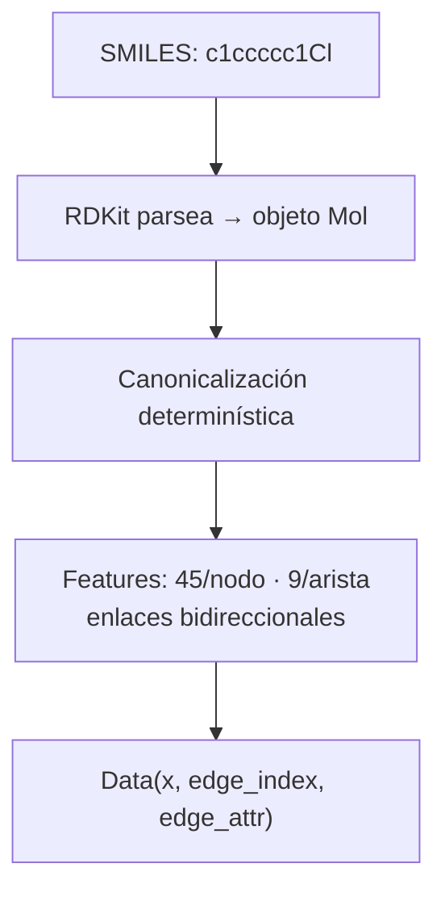
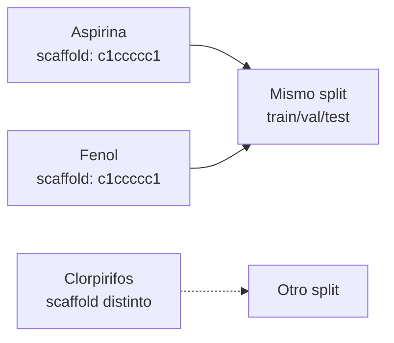
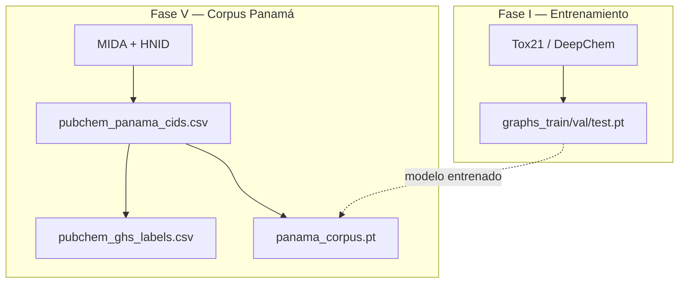

# Fase I — Pipeline de Datos

## 1. El Dataset Tox21

### Qué es Tox21

Tox21 (Toxicology in the 21st Century) es un programa del gobierno de EE.UU. que agrupa al NIH, la EPA y la FDA. Su objetivo es reemplazar los ensayos de toxicidad en animales por ensayos automatizados *in vitro* (en células). El dataset contiene **~8000 compuestos químicos** testeados en **12 ensayos biológicos** que miden si una molécula activa o no una vía biológica asociada a toxicidad.

Cada molécula se representa como un SMILES (Simplified Molecular Input Line Entry System), una cadena de texto que codifica la estructura molecular. Por ejemplo:
- `CCO` = etanol (C-C-O)
- `c1ccccc1` = benceno (anillo aromático de 6 carbonos)
- `CCOP(=S)(OCC)Oc1cc(Cl)c(Cl)cc1Cl` = clorpirifos (insecticida)

### Las 12 dianas biológicas

Cada diana es un ensayo *in vitro* que detecta si la molécula interactúa con una proteína o vía celular específica. Se dividen en dos familias:

#### Receptores Nucleares (NR) — Disrupción endocrina

Estos ensayos detectan si una molécula puede interferir con el sistema hormonal, causando problemas reproductivos, de desarrollo o metabólicos.

| Tarea | Diana biológica | Qué detecta | Ejemplo de tóxico conocido |
|---|---|---|---|
| **NR-AR** | Receptor de andrógenos | Molécula que imita o bloquea testosterona | Vinclozolina (fungicida) |
| **NR-AR-LBD** | Dominio de unión a ligando del AR | Unión directa al receptor androgénico | Flutamida (anti-andrógeno) |
| **NR-AhR** | Receptor aril-hidrocarburo | Activación de respuesta a tóxicos ambientales (dioxinas, PCBs) | Dioxina (TCDD) |
| **NR-Aromatase** | Enzima aromatasa (CYP19) | Inhibición de la conversión testosterona → estrógeno | Letrozol (inhibidor CYP) |
| **NR-ER** | Receptor de estrógenos | Molécula que imita o bloquea estrógeno | Bisfenol A (BPA) |
| **NR-ER-LBD** | Dominio de unión a ligando del ER | Unión directa al receptor estrogénico | Dietilestilbestrol (DES) |
| **NR-PPAR-gamma** | Receptor PPAR-γ | Alteración del metabolismo de grasas y glucosa | Tiazolidinedionas |

#### Respuesta al Estrés (SR) — Daño celular directo

Estos ensayos detectan si una molécula causa daño directo a las células: estrés oxidativo, daño al ADN, o disfunción mitocondrial.

| Tarea | Diana biológica | Qué detecta | Ejemplo de tóxico conocido |
|---|---|---|---|
| **SR-ARE** | Vía Nrf2/ARE (estrés oxidativo) | Molécula que genera radicales libres o agota antioxidantes | Paraquat (herbicida) |
| **SR-AtAD5** | Daño al ADN (genotoxicidad) | Molécula que daña directamente el ADN | Cisplatino (quimioterapia) |
| **SR-HSE** | Respuesta al estrés por calor | Molécula que desnaturaliza proteínas (proteotoxicidad) | Geldanamicina |
| **SR-MMP** | Potencial de membrana mitocondrial | Molécula que despolariza la mitocondria (energía celular) | FCCP (desacoplador) |
| **SR-p53** | Vía p53 (guardián del genoma) | Molécula que activa la respuesta de daño al ADN / carcinogénesis | Nutlina (activador p53) |

### Estructura de los datos

Cada molécula tiene:
- **SMILES**: representación textual de su estructura
- **12 etiquetas binarias**: 1 (activa/tóxica) o 0 (inactiva) en cada ensayo
- **Muchos valores faltantes (NaN)**: no todas las moléculas se testearon en los 12 ensayos

Ejemplo de una fila del dataset:

```
SMILES: CCOP(=S)(OCC)Oc1cc(Cl)c(Cl)cc1Cl   (clorpirifos)
NR-AR: 0    NR-AhR: 1    NR-ER: 0    SR-ARE: 1    SR-p53: NaN
...
```

### Desbalance de clases

La mayoría de las moléculas son **inactivas** en cada ensayo. Las tasas de positivos típicas son:
- NR-AR: ~2% positivos (muy desbalanceado)
- SR-MMP: ~15% positivos (moderado)
- NR-AhR: ~10% positivos

Este desbalance es un desafío técnico que manejamos con `MaskedBCELoss` y opcionalmente con `pos_weight`.

---

## 2. Conversión SMILES → Grafo Molecular

### Por qué grafos

Una molécula ES un grafo de forma natural:
- **Nodos** = átomos (carbono, nitrógeno, oxígeno, etc.)
- **Aristas** = enlaces químicos (simple, doble, triple, aromático)

Representar moléculas como grafos tiene ventajas sobre otras representaciones:

| Representación | Pros | Contras |
|---|---|---|
| Descriptores moleculares (2D) | Rápido, interpretable | Requiere elegir ~5000 descriptores manualmente |
| Fingerprints (ECFP4) | Estándar en quimioinformática | Pierde información estructural 3D, no mapea a átomos |
| SMILES como texto | Simple | El mismo átomo puede estar en posiciones diferentes del texto |
| **Grafo molecular** | **Representación nativa, invariante a permutaciones, XAI directa sobre átomos** | Requiere GNN |

### Características de cada átomo (45 dimensiones)

El vector de características de cada nodo codifica propiedades químicas relevantes:

| Característica | Dimensiones | Qué codifica |
|---|---|---|
| Tipo de átomo | 10 | C, N, O, F, P, S, Cl, Br, I, otro (one-hot) |
| Grado | 11 | Número de átomos vecinos: 0-10 (one-hot) |
| Hibridación | 6 | Geometría orbital: S, SP, SP2, SP3, SP3D, SP3D2 |
| Aromaticidad | 1 | ¿Está en un anillo aromático? (0 o 1) |
| Hidrógenos | 5 | Número de hidrógenos: 0-4 (one-hot) |
| Carga formal | 5 | Carga eléctrica: -2, -1, 0, +1, +2 (one-hot) |
| En anillo | 1 | ¿Pertenece a un anillo? (0 o 1) |
| Tamaño de anillo | 6 | Anillo más pequeño: 3, 4, 5, 6, 7, ≥8 (one-hot) |

### Características de cada enlace (9 dimensiones)

| Característica | Dimensiones | Qué codifica |
|---|---|---|
| Tipo de enlace | 4 | Simple, doble, triple, aromático (one-hot) |
| Conjugación | 1 | ¿Es un enlace conjugado? (electrones deslocalizados) |
| En anillo | 1 | ¿El enlace está dentro de un anillo? |
| Estereoquímica | 3 | Ninguna, E (trans), Z (cis) |

### El proceso de conversión



Cada enlace se duplica porque el grafo es **no dirigido**: si hay un enlace C-Cl, creamos aristas C→Cl y Cl→C.

---

## 3. Scaffold Split

### El problema del split aleatorio

Si divides las moléculas aleatoriamente en train/test, moléculas **muy similares** pueden caer en ambos conjuntos. El modelo memoriza similitudes en vez de aprender generalización, inflando el AUC hasta un +15%.

### La solución: scaffold de Murcko

El **scaffold** es el esqueleto molecular: la estructura de anillos y enlaces sin cadenas laterales. Moléculas con el mismo scaffold van siempre al mismo split.



Aspirina y fenol comparten scaffold → van al mismo split. Esto evalúa si el modelo puede predecir toxicidad de **familias moleculares que nunca vio** durante el entrenamiento.

### Proporciones del split

| Conjunto | Proporción | Uso |
|---|---|---|
| Train | 70% | Entrenar los pesos del modelo |
| Validación | 15% | Ajustar hiperparámetros, early stopping |
| Test | 15% | Evaluación final (solo se toca una vez) |

---

## 4. Manejo de datos faltantes (MaskedBCELoss)

Tox21 tiene **muchos NaN**: no todas las moléculas se testearon en los 12 ensayos. No podemos:
- Eliminar las filas con NaN (perderíamos casi todo el dataset)
- Tratar NaN como 0 (introduciría falsos negativos)

Solución: una **máscara booleana** que indica qué posiciones tienen medición real. La función de pérdida (`MaskedBCELoss`) solo calcula el error sobre las posiciones con `mask=True`, ignorando completamente las posiciones NaN.

```python
# Ejemplo: molécula con 3 tareas medidas y 9 sin medir
mask = [True, True, False, False, True, False, False, False, False, False, False, False]
# La pérdida solo se calcula sobre las 3 posiciones True
```

---

## 5. Corpus de plaguicidas panameños (PubChem API)

### Propósito

El corpus panameño es un conjunto **separado** de plaguicidas registrados en Panamá. NO se usa para entrenar el modelo — se usa para **evaluar** el modelo ya entrenado y para **validación externa** contra etiquetas GHS.

La lógica de descarga vive en `src/data/pubchem_api.py`; el orquestador es `scripts/fase5/build_panama_corpus.py` (Fase V).



### Fuentes de datos y endpoints

| Paso | API PubChem | Archivo generado |
|---|---|---|
| CIDs por nombre MIDA | `PUG /compound/name/{nombre}/property/SMILES,...` | `data/raw/pubchem_panama_cids.csv` |
| CIDs por familia | `PUG /classification/hnid/{hnid}/cids` | (mismo CSV) |
| SMILES en lote | `PUG /compound/cid/{cids}/property/SMILES` | columna `SMILES_canonical` |
| Etiquetas GHS | `PUG View /data/compound/{cid}` | `data/raw/pubchem_ghs_labels.csv` |
| Grafos PyG | RDKit + `featurizer.py` | `data/processed/panama_corpus.pt` |

### HNID vs HID

El árbol de plaguicidas en el navegador usa `hid=72`, pero la API requiere **HNID** (p. ej. Organophosphates → `4400064`). Ver tabla completa en [fase5_panama.md](fase5_panama.md).

### Ingredientes activos del MIDA

20 ingredientes prioritarios buscados por nombre: clorpirifos, malatión, atrazina, tebuconazol, glifosato, paraquat, etc. (`MIDA_ACTIVE_INGREDIENTS` en `pubchem_api.py`).

### Robustez del cliente

- Reintentos HTTP (`MAX_RETRIES=3`) con backoff
- Guardado atómico de CSV (`.tmp` → rename)
- Compatibilidad `SMILES` / `ConnectivitySMILES` / `CanonicalSMILES`
- Rate limiting entre peticiones (0.35–0.5 s)

### EDA

`notebooks/00_pubchem_panama_eda.ipynb` — cobertura MIDA vs familias, calidad SMILES, scaffolds Murcko, grupos funcionales.

---

## 6. Integración con el visor web (`viz/`)

El pipeline de datos de la Fase I es la base que consume el **GNN-Tox Viewer** (`viz/`): la aplicación FastAPI reutiliza el mismo featurizer, las mismas 12 tareas Tox21 y el corpus de plaguicidas panameños, pero orientado a exploración interactiva en lugar de entrenamiento.

### Reutilización del featurizer

Cuando el visor recibe un SMILES (formulario del dashboard o API `/api/predict`), llama a `src.data.featurizer.smiles_to_graph` a través de `viz/services/inference.py`. Esto garantiza que:

- Los **45 features por nodo** y **9 por arista** son idénticos a los del entrenamiento
- La **canonicalización RDKit** es la misma que en `prepare_tox21_graphs.py`
- Los índices de átomos en las explicaciones XAI coinciden con los del grafo del modelo

### Estructura 3D para el visor

Además del grafo 2D, `viz/services/molecule.py` genera coordenadas 3D con RDKit (ETKDGv3 + optimización MMFF) y expone SDF/MOL block vía `/api/mol3d`. El frontend ([3Dmol.js](https://3dmol.csb.pitt.edu/)) renderiza la molécula en 3D; los colores XAI se aplican átomo a átomo usando los mismos índices que el featurizer.

### Corpus pre-computado (`viz/data/*.json`)

`scripts/fase4/build_viz_corpus.py` empaqueta 8 plaguicidas prioritarios (clorpirifos, atrazina, tebuconazol, etc.) en archivos JSON con:

| Campo | Origen (Fase I) |
|---|---|
| `smiles`, `properties`, `atom_symbols` | RDKit (`molecular_properties`, canonicalización) |
| `mol_block` | Estructura 3D (ETKDG + MMFF) |
| `predictions`, `xai` | Generados en Fases III–IV (o simulados con `--demo`) |

Modo **demo** (`make setup-viz`): genera JSON con predicciones simuladas para probar la UI sin modelo entrenado. Modo **completo** (`make setup-viz-full`): ejecuta inferencia real sobre el checkpoint GIN.

---

## Archivos clave

| Archivo | Qué hace |
|---|---|
| `src/data/featurizer.py` | Convierte SMILES → grafo PyG (45 features/nodo, 9 features/arista) |
| `src/data/dataset.py` | Carga grafos .pt como Dataset iterable + define TASK_NAMES |
| `src/data/splitter.py` | Scaffold split de Murcko (train/val/test sin filtración) |
| `src/data/pubchem_api.py` | Cliente PubChem (corpus panameño + GHS; ver Fase V) |
| `scripts/fase1/prepare_tox21_graphs.py` | Descarga Tox21 via DeepChem → genera graphs_*.pt |
| `scripts/fase5/build_panama_corpus.py` | Corpus panameño: PubChem → CSV + panama_corpus.pt |
| `viz/services/molecule.py` | SMILES → 3D (SDF/MOL), propiedades fisicoquímicas |
| `scripts/fase4/build_viz_corpus.py` | Empaqueta plaguicidas en `viz/data/*.json` |

## Ejecución

```bash
# Paso 1: Generar grafos de entrenamiento desde Tox21
python scripts/fase1/prepare_tox21_graphs.py

# Paso 2: Construir corpus panameño desde PubChem (Fase V)
make build-panama-corpus

# Paso 3: Análisis exploratorio
jupyter notebook notebooks/01_eda_tox21.ipynb
jupyter notebook notebooks/00_pubchem_panama_eda.ipynb   # EDA corpus Panamá

# Paso 4 (opcional): Corpus JSON para el visor web
make setup-viz          # demo sin modelo
make setup-viz-full       # con predicciones reales (requiere make train-gin)
```
