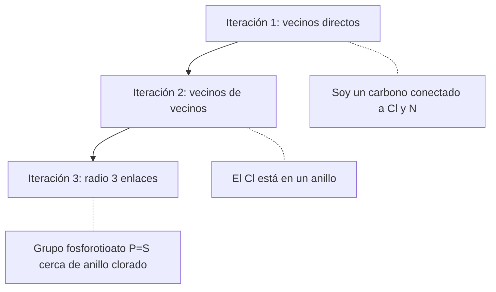
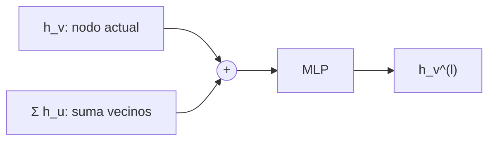
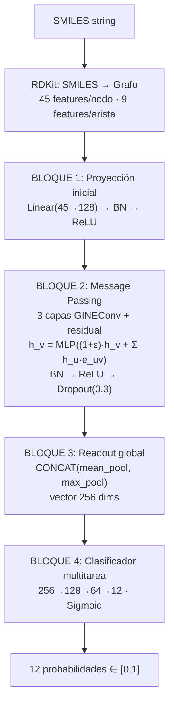
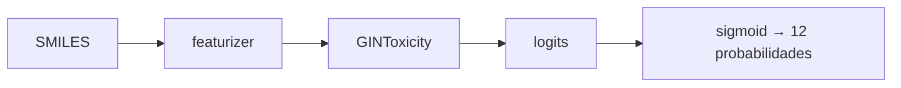

# Fase III — Modelo GNN-GIN

## 1. Qué es una GNN y por qué la necesitamos

### El problema

Queremos predecir si una molécula es tóxica analizando su estructura. Los baselines (RF, MLP) usan fingerprints — vectores fijos que **resumen** la molécula pero pierden la topología (qué átomo está conectado a cuál). La GNN trabaja directamente sobre el **grafo molecular**, preservando toda la información estructural.

### Cómo funciona una GNN (Message Passing)

La idea central es simple: cada átomo "habla" con sus vecinos y actualiza su representación basándose en lo que recibe.



Después de L iteraciones, cada átomo tiene una representación que captura su vecindario químico completo hasta radio L.

---

## 2. Por qué GIN y no GCN o GAT

### GCN (Graph Convolutional Network)
- Agrega vecinos con **promedio ponderado**
- Problema: no distingue entre "1 vecino con valor 6" y "3 vecinos con valor 2" (ambos dan promedio 2)
- Menor expresividad teórica

### GAT (Graph Attention Network)
- Usa **atención** para ponderar vecinos
- Más parámetros, más lento de entrenar
- Los pesos de atención son interpretables pero menos precisos que GNNExplainer para XAI

### GIN (Graph Isomorphism Network)
- Agrega vecinos con **suma** (preserva multiplicidad)
- Añade factor (1 + ε) al nodo central para distinguirlo de sus vecinos
- **Máxima expresividad** dentro de la clase 1-WL (demostrado por Xu et al., ICLR 2019)
- Equivale al test de isomorfismo de Weisfeiler-Lehman — puede distinguir grafos que GCN confunde



### Por qué GINEConv (no GINConv)

GINConv **ignora** las features de los enlaces. Pero en química, el tipo de enlace es crucial:
- Un enlace simple C-C vs doble C=C cambia completamente las propiedades
- La conjugación y la estereoquímica afectan la toxicidad

GINEConv extiende GIN para incorporar las 9 features de cada enlace en la agregación.

---

## 3. Arquitectura completa



### Conexiones residuales

Sin conexiones residuales, después de muchas capas GIN todos los nodos convergen a representaciones similares (**over-smoothing**). La conexión residual `h_v = h_v + h_v_anterior` permite que cada capa **refine** la representación en vez de reemplazarla.

### Por qué mean + max pooling

- **Mean pooling solo**: si una molécula tiene 50 átomos y solo 1 es tóxico, el promedio "diluye" la señal del átomo tóxico
- **Max pooling solo**: puede ser inestable y perder información de la composición general
- **Mean + max**: captura ambos — la composición global Y los átomos extremos

---

## 4. Entrenamiento

### Función de pérdida: MaskedBCELoss

Binary Cross Entropy con máscara para datos faltantes:
1. Calcula la pérdida para TODAS las 12 tareas
2. Multiplica por la máscara (0 donde no hay medición)
3. Promedia solo sobre las posiciones con medición real

### Optimización

| Parámetro | Valor | Por qué |
|---|---|---|
| Optimizador | Adam | Estándar para deep learning, adaptativo |
| Learning rate | 0.001 | Valor típico para GNN |
| Gradient clipping | norma ≤ 1.0 | Evita explosión de gradientes en grafos |
| Batch size | 32 | Balance entre estabilidad y memoria |

### Regularización

| Técnica | Valor | Efecto |
|---|---|---|
| Dropout | 0.3 | Apaga 30% de neuronas aleatoriamente → evita overfitting |
| BatchNorm | en cada capa | Estabiliza el entrenamiento, permite LR más alto |
| Early stopping | paciencia 50 | Detiene si val_AUC no mejora por 50 épocas |
| LR scheduler | factor 0.5, paciencia 20 | Reduce LR a la mitad si no mejora por 20 épocas |

### 5-Fold Cross-Validation

Para obtener una estimación robusta del rendimiento:

1. Tomar los datos de train+val
2. Crear 5 particiones por scaffold (ningún scaffold cruzado entre folds)
3. Para cada fold: entrenar con 4/5, validar con 1/5, evaluar en test
4. Reportar: media ± desviación estándar del AUC sobre los 5 folds

---

## 5. Métricas objetivo

| Métrica | Mínimo | Ideal |
|---|---|---|
| AUC-ROC promedio (12 tareas) | > 0.82 | > 0.84 |
| AUC-ROC por tarea individual | > 0.75 en todas | > 0.80 en todas |
| Desviación estándar entre folds | < 0.02 | < 0.015 |
| Supera RF baseline | Obligatorio | +0.05 AUC |
| Supera SMILES2vec baseline | Objetivo principal | +0.02 AUC |

### Ablation study planificado

| Variante | Cambio | Propósito |
|---|---|---|
| hidden_dim=256 | Duplicar dimensión oculta | ¿Más capacidad mejora AUC? |
| n_layers=5 | 5 capas en vez de 3 | ¿Mayor radio de vecindario ayuda? |
| Sin residual | Quitar conexiones residuales | Confirmar que evitan over-smoothing |
| Sin edge features | GINConv en vez de GINEConv | Confirmar que los enlaces importan |

---

## 6. Integración con el visor web (`viz/`)

El modelo entrenado en esta fase es el motor de inferencia del **GNN-Tox Viewer**. Tras `make train-gin`, el checkpoint `outputs/models/best_gin_model.pt` queda disponible para el visor.

### Carga del modelo en producción

`viz/services/inference.py` implementa un singleton que:

1. Lee hiperparámetros de `config/config.yaml` (mismos `node_feat_dim`, `hidden_dim`, `n_layers`, etc.)
2. Instancia `GINToxicity` desde `src/models/gin.py`
3. Carga los pesos de `outputs/models/best_gin_model.pt`
4. Ejecuta en CPU o CUDA según disponibilidad



```python
# Equivalente en código (viz/services/inference.py)
graph = smiles_to_graph(smiles)
logits = model(graph.x, graph.edge_index, batch, edge_attr=graph.edge_attr)
probs = sigmoid(logits)
```

### API REST de predicción

| Endpoint | Qué hace |
|---|---|
| `POST /api/predict` | Predicción multitarea sobre un SMILES arbitrario |
| `POST /api/analyze` | Predicción + XAI para tareas con P > 0.4 y la de mayor riesgo |
| `GET /api/status` | Indica si el modelo está cargado y en qué dispositivo |

Si el checkpoint no existe, la API responde **503** con el mensaje `make train-gin`. El modo demo del corpus (`make setup-viz`) permite explorar la UI con predicciones simuladas sin modelo.

### Corpus pre-computado

`scripts/fase4/build_viz_corpus.py` (sin `--demo`) ejecuta `full_analysis()` por cada plaguicida y guarda las predicciones en `viz/data/{id}.json`. Esto evita recalcular inferencia en cada visita al dashboard.

### Comandos Makefile

```bash
make train-gin              # entrena y guarda best_gin_model.pt
make setup-viz-full         # genera corpus JSON con predicciones reales
make viz                    # http://127.0.0.1:8000
make viz-lan                # accesible en red local (presentaciones JIC)
```

---

## Archivos clave

| Archivo | Qué hace |
|---|---|
| `src/models/gin.py` | Arquitectura GINToxicity (GINEConv + residual) |
| `src/training/trainer.py` | Loop de entrenamiento con early stopping |
| `src/training/loss.py` | MaskedBCELoss (ignora NaN + pos_weight) |
| `src/evaluation/cross_validation.py` | AUC-ROC + scaffold folds para 5-fold CV |
| `config/config.yaml` | Todos los hiperparámetros centralizados |
| `viz/services/inference.py` | Carga GINToxicity + `predict()` / `full_analysis()` |
| `viz/routes/api.py` | Endpoints REST de predicción |
| `scripts/fase4/build_viz_corpus.py` | Pre-computa predicciones para el dashboard |
| `outputs/models/best_gin_model.pt` | Checkpoint consumido por el visor |
