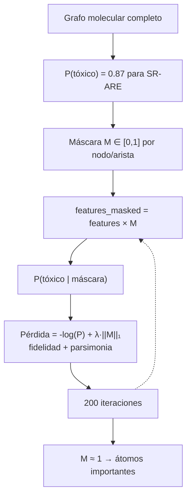
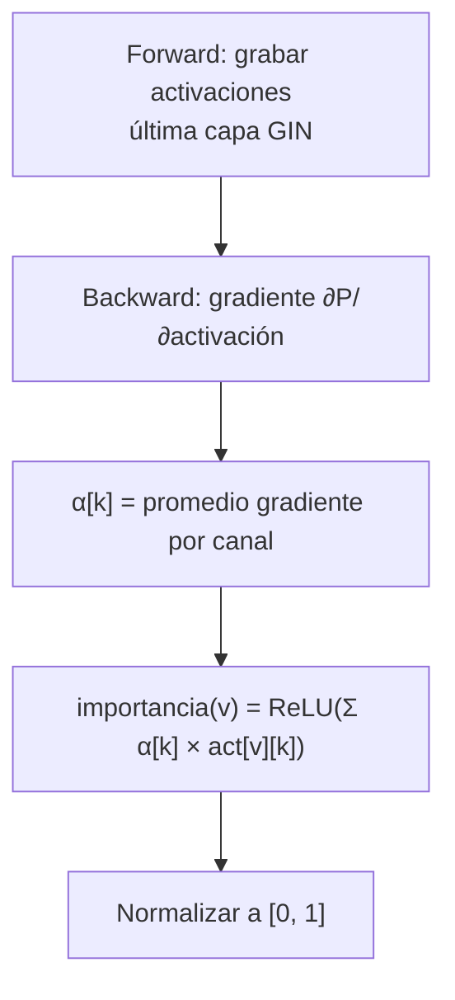
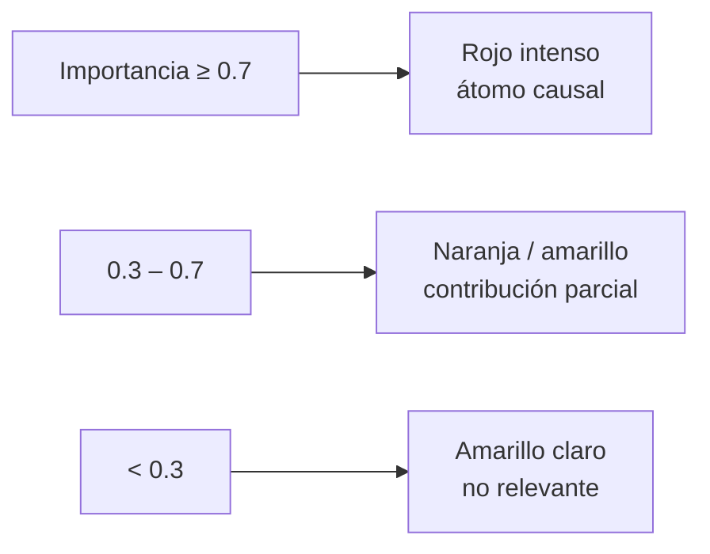
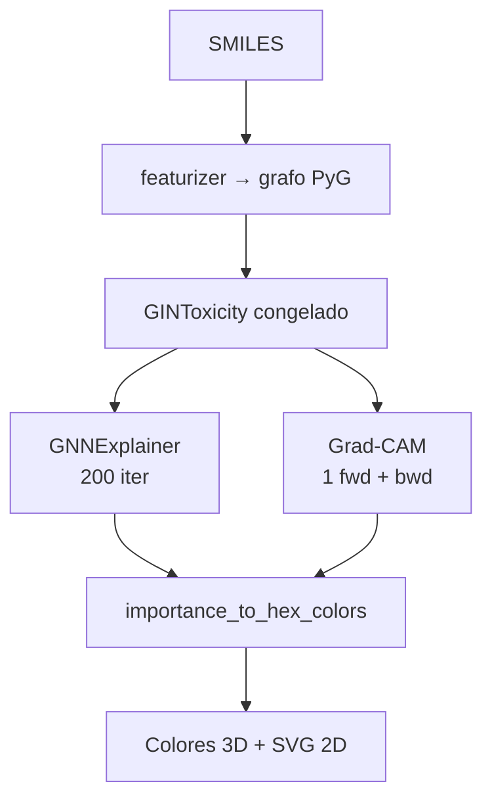
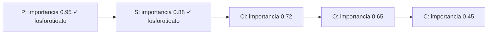
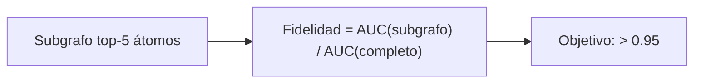
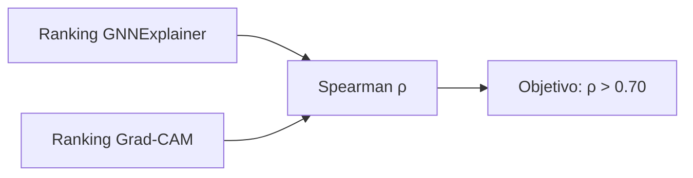

# Fase IV — Explainable AI (XAI)

## 1. Por qué necesitamos explicabilidad

El modelo GNN-GIN predice que una molécula es tóxica, pero no dice **por qué**. Para un regulador del MIDA o del MINSA, un número (P=0.87 de toxicidad) no es suficiente — necesita saber:

- **¿Qué parte de la molécula causa la toxicidad?**
- **¿El modelo está mirando los átomos correctos?**
- **¿La predicción es coherente con lo que se sabe en la literatura?**

La XAI (Explainable AI) responde estas preguntas identificando qué **átomos y enlaces** del grafo molecular son los más importantes para cada predicción.

---

## 2. Los dos métodos de explicación

Usamos dos métodos complementarios porque cada uno tiene fortalezas y debilidades:

### GNNExplainer — Optimización de máscara

**Publicación:** Ying et al., "GNNExplainer: Generating Explanations for Graph Neural Networks", NeurIPS 2019.

**Idea central:** Encontrar el **subgrafo más pequeño** que produce la misma predicción que el grafo completo.

**Cómo funciona paso a paso:**



**Ventaja:** Muy preciso — encuentra exactamente el subgrafo mínimo necesario.
**Desventaja:** Lento — 200 forward passes por molécula por tarea.

**Detalle técnico — _SingleTaskWrapper:**
GNNExplainer de PyG espera un modelo con **una sola salida**. Pero GINToxicity tiene 12 salidas (una por tarea). El `_SingleTaskWrapper` envuelve el modelo para que solo retorne el logit de la tarea que queremos explicar:

```python
class _SingleTaskWrapper(nn.Module):
    def __init__(self, model, task_index):
        self.model = model
        self.task_index = task_index

    def forward(self, x, edge_index, batch, edge_attr=None):
        logits = self.model(x, edge_index, batch, edge_attr=edge_attr)
        return logits[:, self.task_index].unsqueeze(-1)  # solo 1 salida
```

**Detalle técnico — agregación de `node_mask` (atributos → átomos):**

Con `node_mask_type="attributes"`, PyG devuelve una máscara por **feature de nodo** (45 dimensiones en este proyecto), no necesariamente una por átomo. En moléculas normales la forma es `(N, 45)` y se promedia sobre la dimensión de features. En grafos de **un solo átomo** (p. ej. `SMILES=N`), PyG a veces devuelve un vector plano de longitud 45 en lugar de `(1, 45)`.

`src/xai/gnn_explainer.py` normaliza esto antes de visualizar:

| Forma de `node_mask` | Acción |
|---|---|
| `(N,)` con `N` = número de átomos | Usar directamente |
| `(N, F)` | Promedio sobre `F` (features) |
| `(F,)` con un solo átomo | Promedio escalar → un valor por átomo |

Si la máscara de aristas viene vacía (`edge_mask.numel() == 0`), se rellena con ceros en lugar de fallar al normalizar.

**Detalle técnico — modo `eval()` en batch offline:**
En `explain_panama.py` el modelo permanece en `eval()` para inferencia con batch=1. GNNExplainer puede dejar el modelo en `train()`; el script restaura `eval()` tras cada explicación para evitar fallos de BatchNorm en el clasificador (`Expected more than 1 value per channel when training`).

### Grad-CAM para grafos — Gradientes × Activaciones

**Publicación original:** Selvaraju et al., "Grad-CAM: Visual Explanations from Deep Networks", ICCV 2017. Adaptado aquí para grafos.

**Idea central:** Los átomos que más contribuyen a la predicción son aquellos que activaron fuertemente canales que el modelo considera importantes para esa tarea.

**Cómo funciona paso a paso:**



**Ventaja:** Muy rápido — un solo forward + backward por molécula.
**Desventaja:** Más ruidoso que GNNExplainer, puede señalar átomos "cerca" del importante.

`grad_cam.py` ejecuta siempre en `model.eval()` para evitar el mismo fallo de BatchNorm con batch=1.

---

## 3. Visualización molecular

Una vez que tenemos la importancia de cada átomo, la visualizamos coloreando la molécula con la paleta **YlOrRd** (amarillo → rojo):



### Visor 2D (SVG con RDKit)

`src/xai/visualizer.py` genera SVG donde cada átomo se colorea según su importancia. La función `importance_to_hex_colors()` produce colores hex **idénticos** en servidor y cliente, garantizando coherencia visual.

**Requisito de alineación:** `node_importance` debe tener exactamente un valor por átomo del grafo canónico (misma canonicalización RDKit que `featurizer.py`). Si no coincide, `draw_molecule_with_importance()` lanza `ValueError`; en el pipeline batch (`explain_panama.py`) ese caso se **omite** con `[SKIP]` en lugar de abortar todo el corpus.

### Visor 3D interactivo (GNN-Tox Viewer)

El módulo `viz/` extiende la visualización estática a una interfaz web completa:

| Componente | Tecnología | Rol |
|---|---|---|
| Servidor | FastAPI (`viz/app.py`) | Sirve páginas, API REST y estáticos |
| Estructura 3D | RDKit ETKDG + 3Dmol.js | Coordenadas 3D + render interactivo |
| Coloración XAI | `importance_to_hex_colors` | Mismos colores en 3D y 2D |
| Vista 2D embebida | SVG vía `/api/svg` | Alternativa plana sincronizada |
| Tabla de átomos | `molecule.js` | Hover sincronizado con el visor 3D |

El usuario puede alternar entre **Grad-CAM** y **GNNExplainer**, seleccionar la diana biológica Tox21 y ver la importancia por átomo en tiempo real.

### Flujo XAI en el visor



En análisis en vivo (`POST /api/explain`), el método y la tarea se eligen por parámetro. En el corpus pre-computado (`viz/data/*.json`), `build_viz_corpus.py` calcula XAI para la tarea de mayor riesgo y todas las que superan P > 0.4.

### Páginas del visor

| Ruta | Contenido XAI |
|---|---|
| `/` | Dashboard con corpus, filtros por riesgo/familia, búsqueda SMILES |
| `/molecule/{id}` | Vista detallada: 3D + 2D + selector método/tarea + tabla átomos |
| `/analyze?smiles=...` | Análisis ad hoc de cualquier SMILES (requiere modelo) |

Los compuestos marcados como **«Ejemplo de prueba»** (`demo: true`) muestran importancias simuladas — útiles para demos sin GPU, no para validación química.

---

## 4. Validación química de las explicaciones

### El problema
Que el modelo señale un átomo como "importante" no significa que sea correcto. Necesitamos verificar que los átomos señalados corresponden a **grupos funcionales con toxicidad documentada**.

### Patrones SMARTS por vía de toxicidad

Para cada tarea Tox21, definimos patrones SMARTS (un lenguaje de búsqueda de subestructuras) que representan los grupos funcionales conocidos por causar toxicidad en esa vía:

| Tarea | Grupo funcional esperado | Patrón SMARTS | Por qué es tóxico |
|---|---|---|---|
| **SR-ARE** | Fosforotioato (P=S) | `[P](=S)([O,S])([O,S])` | Genera radicales libres al metabolizarse |
| **SR-ARE** | Grupo nitro | `[N+](=O)[O-]` | Electrófilo que depleta glutatión |
| **NR-AhR** | Naftaleno | `c1ccc2ccccc2c1` | Aromático plano que encaja en el receptor |
| **NR-Aromatase** | Triazol | `n1cncn1` | Coordina con el hierro del CYP450, inhibiéndolo |
| **NR-ER** | Fenol | `c1ccc(O)cc1` | Mimetiza la estructura del estrógeno |
| **SR-p53** | Epóxido | `C1OC1` | Agente alquilante que daña el ADN |
| **SR-MMP** | Fosforotioato | `[P](=S)([O,S])([O,S])` | Despolariza la membrana mitocondrial |

### Métrica: Precision@k

```
Precision@k = (nº de moléculas donde al menos 1 de los k átomos más importantes
               pertenece a un grupo funcional tóxico conocido)
              / (total de moléculas evaluadas)
```

**Ejemplo con Clorpirifos y SR-ARE:**



### Fidelidad del subgrafo

Otra métrica: si solo mantenemos los 5 átomos más importantes y borramos el resto, ¿la predicción se mantiene?

Precision@1: ✓ (P pertenece al grupo fosforotioato) · Precision@3: ✓



### Coherencia entre métodos

Si GNNExplainer y Grad-CAM señalan los **mismos átomos** como importantes, la explicación es más confiable:



---

## 5. Objetivos de la Fase IV

| Métrica | Objetivo |
|---|---|
| Precision@1 (GNNExplainer) | > 65% |
| Precision@3 (GNNExplainer) | > 80% |
| Precision@1 (Grad-CAM) | > 55% |
| Precision@3 (Grad-CAM) | > 70% |
| Fidelidad del subgrafo top-5 | Diferencia < 0.05 AUC |
| Coherencia GNNExp vs GradCAM | Spearman > 0.70 |

---

## 6. Casos de estudio detallados

Para al menos 3 moléculas del corpus panameño, documentar:

1. **Molécula**: nombre, SMILES, familia química
2. **Predicción**: probabilidades en las 12 tareas, tarea con mayor riesgo
3. **Explicación GNNExplainer**: imagen SVG, top-5 átomos, grupos funcionales
4. **Explicación Grad-CAM**: imagen SVG, top-5 átomos, comparación con GNNExplainer
5. **Validación química**: ¿los átomos señalados corresponden al mecanismo documentado?
6. **Comparación con GHS**: ¿la predicción es coherente con las etiquetas de peligro regulatorias?

---

## 7. Integración con el visor web (`viz/`)

El visor es el principal canal de comunicación de las explicaciones XAI hacia actores no técnicos (MIDA, MINSA, presentación JIC).

### Batch offline (corpus completo)

`scripts/fase5/explain_panama.py` aplica el mismo stack XAI sobre los ~235 compuestos de `panama_corpus.pt`:

- GNNExplainer (200 épocas) + Grad-CAM por tarea con P ≥ 0.4
- Fuerza `model.eval()` tras cada explicación (GNNExplainer deja el modelo en `train()`)
- Agrega máscaras de atributos GNNExplainer a importancia por átomo (`gnn_explainer.py`)
- Omite compuestos/tareas cuya importancia no alinea con el grafo o el SMILES (`[SKIP]` en consola; el JSON guarda `null` en ese método)
- Salidas en `outputs/xai/explanations/` y `outputs/xai/figures/`

### Servicios que orquestan XAI

| Archivo | Función |
|---|---|
| `viz/services/inference.py` | `explain_gnnexplainer()`, `explain_gradcam()`, `full_analysis()` |
| `viz/routes/api.py` | `POST /api/explain`, `POST /api/analyze`, `POST /api/svg`, `POST /api/xai-colors` |
| `viz/services/corpus.py` | Sirve JSON pre-computados con XAI ya calculado |
| `scripts/fase4/build_viz_corpus.py` | Genera `viz/data/*.json` (demo o con modelo real) |

### API REST de explicabilidad

```bash
# Explicación Grad-CAM para clorpirifos en SR-ARE
curl -X POST http://127.0.0.1:8000/api/explain \
  -H "Content-Type: application/json" \
  -d '{"smiles":"CCOP(=S)(OCC)Oc1nc(Cl)c(Cl)cc1Cl","task":"SR-ARE","method":"gradcam"}'

# Análisis completo (predicción + XAI en tareas relevantes)
curl -X POST http://127.0.0.1:8000/api/analyze \
  -H "Content-Type: application/json" \
  -d '{"smiles":"Cc1nc(Cl)c(nc1N(C)C)N(C)C"}'
```

### Ejecución

```bash
make train-gin           # requisito para XAI real
make setup-viz-full      # pre-computa XAI del corpus panameño
make viz                 # servidor en http://127.0.0.1:8000
make viz-prod            # sin auto-reload (demos/presentaciones)
```

---

## Archivos clave

| Archivo | Qué hace |
|---|---|
| `src/xai/gnn_explainer.py` | GNNExplainer con _SingleTaskWrapper |
| `src/xai/grad_cam.py` | Grad-CAM adaptado a grafos |
| `src/xai/visualizer.py` | SVG 2D + `importance_to_hex_colors` (compartido con viz) |
| `src/evaluation/chemical_coherence.py` | Patrones SMARTS + Precision@k |
| `viz/static/js/molecule.js` | Visor 3D/2D interactivo, selector XAI, tabla átomos |
| `viz/static/js/viewer3d.js` | Wrapper 3Dmol.js con coloración por importancia |
| `viz/templates/molecule.html` | Vista detallada de compuesto con paneles XAI |
| `scripts/fase4/build_viz_corpus.py` | Pre-computa predicciones + XAI en `viz/data/` |
| `scripts/fase5/explain_panama.py` | XAI batch sobre corpus panameño completo |
