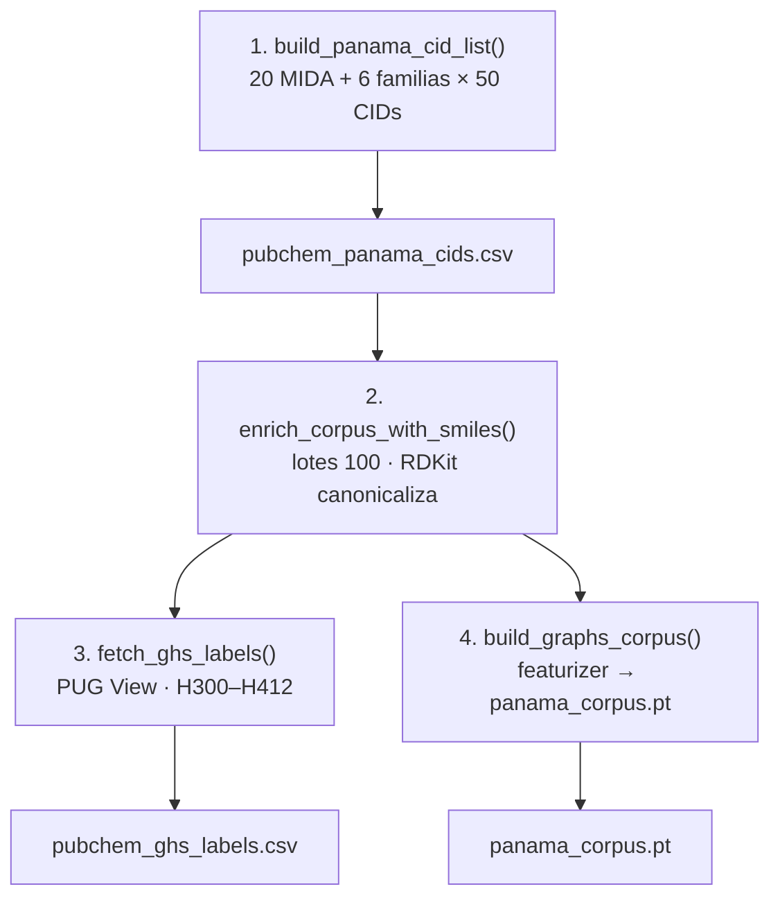
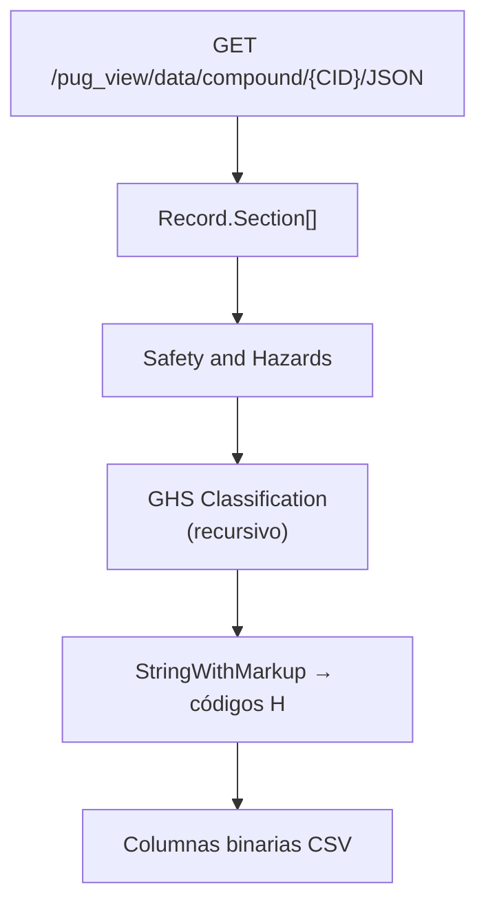
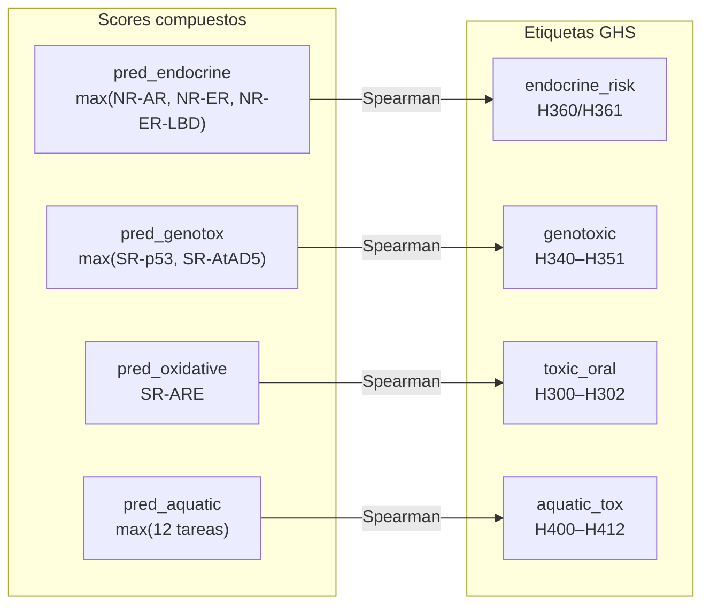
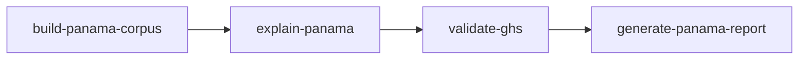
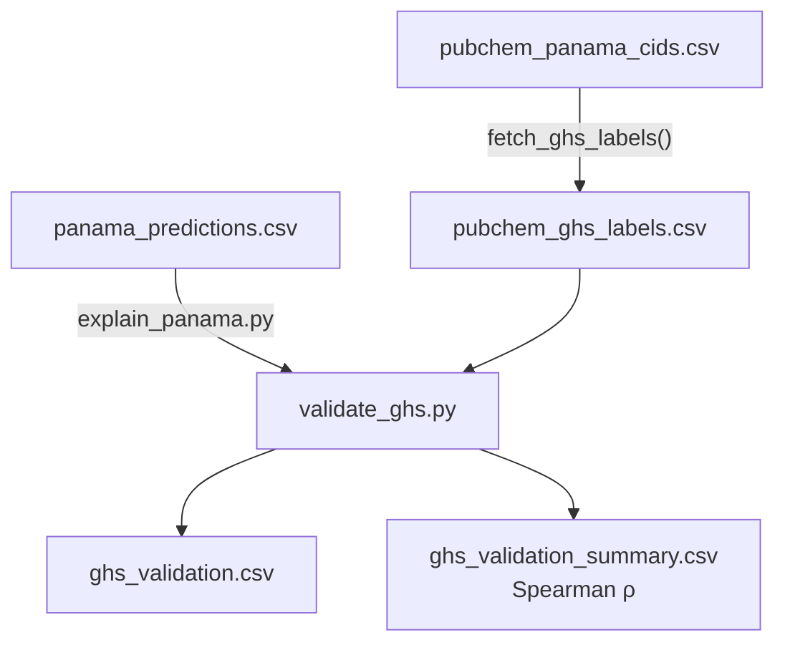

# Fase V — Aplicación a Plaguicidas de Panamá

## 1. Contexto: por qué plaguicidas en Panamá

Panamá es un país con agricultura de exportación intensiva (banano, café, caña de azúcar, piña). Los plaguicidas son esenciales para la producción pero su uso inadecuado tiene consecuencias para la salud humana y los ecosistemas.

### Actores institucionales

| Institución | Rol | Qué necesita |
|---|---|---|
| **MIDA** (Ministerio de Desarrollo Agropecuario) | Registra y autoriza plaguicidas | Herramientas para evaluar toxicidad de nuevos productos |
| **MINSA** (Ministerio de Salud) | Regula exposición humana | Perfiles de riesgo por vía de toxicidad |
| **Productores agrícolas** | Usan los plaguicidas | Alternativas menos tóxicas con eficacia similar |

### El problema actual
La evaluación toxicológica de un plaguicida requiere ensayos costosos y lentos. Este proyecto propone usar **predicción computacional** como herramienta de priorización: identificar rápidamente qué compuestos merecen una evaluación experimental más profunda.

---

## 2. El corpus de plaguicidas panameños

### Ingredientes activos incluidos

Seleccionamos 20 ingredientes activos registrados en el MIDA que representan las principales familias químicas usadas en Panamá:

#### Organofosforados (inhibidores de acetilcolinesterasa)

| Compuesto | Uso principal | Cultivos |
|---|---|---|
| **Clorpirifos** | Insecticida de amplio espectro | Banano, piña, arroz |
| **Malatión** | Insecticida, control de mosquitos | Urbano, hortalizas |
| **Dimetoato** | Insecticida sistémico | Hortalizas, frutales |
| **Metil paratión** | Insecticida (muy tóxico) | Algodón, arroz |

#### Carbamatos (inhibidores de acetilcolinesterasa)

| Compuesto | Uso principal | Cultivos |
|---|---|---|
| **Carbaril** | Insecticida | Frutales, ornamentales |
| **Metomil** | Insecticida | Tabaco, hortalizas |
| **Aldicarb** | Insecticida/nematicida | Banano, papa |

#### Triazinas (inhibidores de fotosíntesis)

| Compuesto | Uso principal | Cultivos |
|---|---|---|
| **Atrazina** | Herbicida | Caña de azúcar, maíz |
| **Simazina** | Herbicida | Frutales, viñedos |

#### Fungicidas azólicos (inhibidores de CYP450)

| Compuesto | Uso principal | Cultivos |
|---|---|---|
| **Tebuconazol** | Fungicida sistémico | Banano, cereales |
| **Propiconazol** | Fungicida | Cereales, banano |
| **Difenoconazol** | Fungicida | Hortalizas, frutales |

#### Piretroides (moduladores de canales de sodio)

| Compuesto | Uso principal | Cultivos |
|---|---|---|
| **Cipermetrina** | Insecticida | Algodón, hortalizas |
| **Deltametrina** | Insecticida | Cultivos varios |
| **Lambda-cihalotrina** | Insecticida | Cultivos varios |

#### Otros

| Compuesto | Tipo | Uso principal |
|---|---|---|
| **Glifosato** | Herbicida (inhibidor de EPSP sintasa) | Cultivos transgénicos, control general |
| **Paraquat** | Herbicida (generador de radicales) | Desecante, control general |
| **2,4-D** | Herbicida auxínico | Pastizales, cereales |
| **Mancozeb** | Fungicida ditiocarbamato | Banano, papa, tomate |
| **Clorotalonil** | Fungicida multiusos | Banano, tomate, papa |

### Fuentes de datos

Los datos se obtienen de **PubChem** (NIH) con trazabilidad reproducible vía API PUG REST:

| Fuente | Endpoint | Salida |
|---|---|---|
| Ingredientes MIDA | `GET /pug/compound/name/{nombre}/property/SMILES,.../JSON` | CID + SMILES por nombre común |
| Familias químicas | `GET /pug/classification/hnid/{hnid}/cids/JSON` | Lista de CIDs por familia |
| Estructuras en lote | `GET /pug/compound/cid/{cids}/property/SMILES/JSON` | SMILES para CIDs sin estructura |
| Etiquetas GHS | `GET /pug_view/data/compound/{cid}/JSON` | H-statements en `Record → Safety and Hazards → GHS` |

> **Nota técnica:** el endpoint `/pug/compound/cid/{cid}/JSON` devuelve `PC_Compounds` (sin secciones GHS). Las etiquetas regulatorias solo están en **PUG View**.

### Corpus actual (tras `make build-panama-corpus`)

| Métrica | Valor |
|---|---|
| Compuestos totales | ~235 CIDs únicos |
| Ingredientes MIDA (búsqueda por nombre) | 20 |
| Por familia (HNID) | Organofosforados (50), Triazinas (41), Piretroides (38), Carbamatos (34), Herbicidas (32), Azoles (20) |
| Grafos PyG (`panama_corpus.pt`) | 235 moléculas con SMILES válido |

> **Compuestos atómicos del árbol HNID:** ~10 entradas del clasificador PubChem tienen SMILES de un solo átomo o ion (`N`, `C`, `Cl`, `Br`, `O`, `[Cl-]`, etc.) — no son plaguicidas completos, sino nodos del árbol de clasificación. Se incluyen en predicciones multitarea pero su XAI es de baja interpretabilidad química. El pipeline `explain_panama.py` sigue procesándolos; si GNNExplainer o Grad-CAM no producen importancias alineadas con el grafo, se omite el SVG y el JSON guarda `null` para ese método (`[SKIP]` en consola).

### Árbol de clasificación: HNID (no HID)

La URL del navegador PubChem usa `hid=72` (Pesticides), pero la API PUG REST requiere **HNID** (node id interno):

| Familia | HNID |
|---|---|
| Organophosphates | 4400064 |
| Carbamates | 4400088 |
| Triazines | 4400160 |
| Azole_fungicides | 4400154 |
| Pyrethroids | 4500164 |
| Herbicides | 4500088 |

Se toman los primeros 50 CIDs por familia para equilibrar diversidad química sin saturar la API.

---

## 3. Pipeline de aplicación

### Paso 1: Construir el corpus (`scripts/fase5/build_panama_corpus.py`)

```bash
make build-panama-corpus          # PubChem completo + GHS + grafos
make build-panama-corpus-fast     # sin descarga GHS (iteración rápida)
make build-panama-corpus-graphs   # solo reconstruir .pt desde CSV existente
```

Flujo interno:



Detalles de implementación en `src/data/pubchem_api.py`:

- **Reintentos HTTP** (`MAX_RETRIES=3`) ante fallos de red
- **Guardado atómico** de CSV (`.tmp` → rename) para evitar archivos corruptos
- **Compatibilidad SMILES**: PubChem renombró `CanonicalSMILES` → `ConnectivitySMILES` / `SMILES`; el cliente acepta ambos
- **Rate limiting**: `time.sleep(0.35–0.5 s)` entre peticiones

EDA del corpus: `notebooks/00_pubchem_panama_eda.ipynb`

### Paso 2: Predicción + XAI (`scripts/fase5/explain_panama.py`)

```bash
make explain-panama
# Opciones:
#   --skip-xai          solo predicciones (rápido)
#   --xai-mida-only     XAI solo en 20 ingredientes MIDA
#   --xai-threshold 0.4 explicar tareas con P ≥ umbral además de la crítica
```

Para cada compuesto en `panama_corpus.pt`:

1. Inferencia GNN-GIN en modo `eval()` → 12 probabilidades
2. Tarea crítica = argmax; alerta: ALTO (>0.7), MODERADO (0.4–0.7), BAJO (<0.4)
3. XAI (si no `--skip-xai`): GNNExplainer + Grad-CAM por tarea relevante
4. Validación de alineación: importancias deben coincidir con `graph.x.size(0)` y con el SMILES canónico RDKit
5. Precision@3 contra grupos funcionales SMARTS (`chemical_coherence.py`) — solo si hay importancias válidas

#### Comportamiento resiliente ante fallos XAI

El script **no aborta** el corpus completo si un compuesto falla en explicabilidad:

| Situación | Acción |
|---|---|
| GNNExplainer lanza excepción (p. ej. `edge_mask` vacío) | `[WARN]` en consola; `gnnexplainer_nodes: null` en JSON |
| Importancias con longitud ≠ número de átomos | `[SKIP]`; no se genera SVG de ese método |
| `draw_molecule_with_importance` rechaza el vector | `[SKIP]`; se conservan predicciones y el resto del XAI |
| GNNExplainer deja el modelo en `train()` | `model.eval()` en bloque `finally` tras cada tarea |

Funciones clave en `scripts/fase5/explain_panama.py`: `_normalize_importance()` (devuelve `None` si el array está vacío), `_importance_aligns_with_graph()` (comprueba grafo + SMILES canónico).

Salidas:

| Archivo | Contenido |
|---|---|
| `outputs/results/panama_predictions.csv` | 12 probabilidades + alerta por compuesto |
| `outputs/reports/panama_pesticides_profile.csv` | Perfil resumido |
| `outputs/xai/explanations/{slug}.json` | Máscaras XAI + precision@3 |
| `outputs/xai/figures/{slug}_{tarea}_*.svg` | Moléculas coloreadas (solo si XAI alineado) |

> **BatchNorm:** GNNExplainer deja el modelo en `train()`; `explain_panama.py` fuerza `model.eval()` tras cada XAI para evitar fallos con batch=1.

> **Agregación GNNExplainer:** con `node_mask_type="attributes"`, `src/xai/gnn_explainer.py` convierte máscaras por feature (45 dims) a un valor por átomo antes de normalizar y visualizar. Ver [docs/fase4_xai.md](fase4_xai.md).

### Paso 3: Validación externa GHS (`scripts/fase5/validate_ghs.py`)

```bash
make validate-ghs
```

**Objetivo:** comprobar si las predicciones del modelo (entrenado en Tox21) correlacionan con peligros documentados por reguladores (GHS), **sin usar GHS para entrenar**.

#### Extracción de etiquetas GHS (Paso 1 del corpus)

Para cada CID, `fetch_ghs_labels()`:



1. Descarga el endpoint PUG View (no PUG Compound)
2. Localiza `Record → Section[]` con `TOCHeading == "Safety and Hazards"`
3. Recorre **recursivamente** todas las subsecciones (p. ej. `Hazards Identification → GHS Classification`)
4. Extrae códigos H de `Information[].Value.StringWithMarkup[].String`
5. Agrega columnas binarias:

| Columna CSV | Códigos GHS detectados |
|---|---|
| `toxic_oral` | H300, H301, H302 |
| `endocrine_risk` | H360, H361 |
| `genotoxic` | H340, H341, H350, H351 |
| `aquatic_tox` | H400, H410, H411, H412 |
| `ghs_codes` | Todos los H-codes unidos con `\|` |

#### Correlación predicción ↔ GHS



`validate_ghs.py` construye **scores compuestos** a partir de las 12 tareas Tox21 y los compara con las etiquetas GHS vía **Spearman**:

| Score compuesto | Cálculo desde predicciones | Etiqueta GHS |
|---|---|---|
| `pred_endocrine` | max(NR-AR, NR-ER, NR-ER-LBD) | `endocrine_risk` |
| `pred_genotox` | max(SR-p53, SR-AtAD5) | `genotoxic` |
| `pred_oxidative` | SR-ARE | `toxic_oral` |
| `pred_aquatic` | max(todas las tareas) | `aquatic_tox` |

Join por `cid` (predicciones) ↔ `CID` (GHS). Si una columna GHS no tiene variación (todos 0 o todos 1), se reporta `sin variación en GHS`.

Salidas:

| Archivo | Contenido |
|---|---|
| `outputs/reports/ghs_validation.csv` | Detalle por compuesto: predicciones compuestas + flags GHS |
| `outputs/reports/ghs_validation_summary.csv` | ρ de Spearman por par predicción–GHS |

Análisis interactivo: `notebooks/07_ghs_validation.ipynb`

### Paso 4: Reporte institucional (`scripts/fase5/generate_report.py`)

```bash
make generate-panama-report
```

Genera `outputs/reports/report_mida_minsa.md` y `.pdf` con:

- Resumen de alertas (ALTO/MODERADO/BAJO) en ingredientes MIDA
- 6 casos prioritarios (clorpirifos, atrazina, tebuconazol, cipermetrina, paraquat, glifosato)
- Tabla de 12 vías Tox21 con descripciones en lenguaje accesible
- Referencias a figuras XAI en `outputs/xai/figures/`

### Pipeline completo



```bash
make panama-all
```

Equivalente manual:

```bash
python scripts/fase5/build_panama_corpus.py
python scripts/fase5/explain_panama.py --model outputs/models/best_gin_model.pt
python scripts/fase5/validate_ghs.py
python scripts/fase5/generate_report.py --results outputs/xai/ --output outputs/reports/
```

---

## 4. Casos de estudio prioritarios

### Caso 1: Clorpirifos (Organofosforado)

**¿Por qué es prioritario?** Es el insecticida más usado en el cultivo de banano en Panamá. Prohibido en la UE desde 2020 por neurotoxicidad.

```
SMILES: CCOP(=S)(OCC)Oc1cc(Cl)c(Cl)cc1Cl
Familia: Organofosforado
Mecanismo: Inhibe acetilcolinesterasa; el grupo P=S se bioactiva a P=O en el hígado
```

**Predicción esperada:**
- **SR-ARE** (estrés oxidativo): ALTO — el metabolismo del grupo fosforotioato genera radicales
- **NR-AhR** (receptor AhR): ALTO — el anillo triclorobenceno activa AhR
- **SR-MMP** (mitocondria): MODERADO — los organofosforados afectan la cadena respiratoria

**Grupo funcional clave:** El fósforo (P) y el azufre (S=) del grupo fosforotioato.

**Validación GHS esperada:** H301 (tóxico por ingestión), H311 (tóxico por contacto), H410 (muy tóxico para vida acuática).

### Caso 2: Atrazina (Triazina)

**¿Por qué es prioritario?** Herbicida ampliamente usado en caña de azúcar. Es un disruptor endocrino conocido — causa feminización en anfibios.

```
SMILES: CCNc1nc(Cl)nc(NC(C)C)n1
Familia: Triazina
Mecanismo: Inhibe fotosíntesis (plantas); en animales, induce aromatasa → exceso de estrógeno
```

**Predicción esperada:**
- **NR-AR** (andrógenos): ALTO — interfiere con señalización androgénica
- **NR-ER** (estrógenos): ALTO — induce producción de estrógeno vía aromatasa
- **NR-Aromatase**: MODERADO — induce (no inhibe) aromatasa

**Grupo funcional clave:** El anillo triazina con el cloro.

### Caso 3: Tebuconazol (Azol)

**¿Por qué es prioritario?** Fungicida sistémico usado en banano. Los azoles inhiben enzimas CYP450 humanas además de las fúngicas.

```
SMILES: OC(Cn1cncn1)(c1ccc(Cl)cc1)C(C)(C)C
Familia: Triazol
Mecanismo: El anillo triazol coordina con el hierro del grupo hemo de CYP450
```

**Predicción esperada:**
- **NR-Aromatase**: ALTO — inhibe CYP19 (aromatasa es un CYP450)
- **NR-PPAR-gamma**: MODERADO — los azoles afectan metabolismo lipídico

**Grupo funcional clave:** El anillo triazol (n1cncn1) y el cloro del fenilo.

### Caso 4: Cipermetrina (Piretroide)

```
SMILES: CC1(C)C(C=C(Cl)Cl)C1C(=O)OC(C#N)c1cccc(Oc2ccccc2)c1
Familia: Piretroide sintético
Mecanismo: Modula canales de sodio → hiperexcitación nerviosa
```

**Predicción esperada:**
- **SR-HSE** (estrés por calor): ALTO — la hiperexcitación desnaturaliza proteínas
- **SR-MMP** (mitocondria): MODERADO — afecta la cadena de transporte electrónico

### Caso 5: Paraquat (Herbicida bipiridilos)

```
SMILES: C[n+]1ccc(-c2cc[n+](C)cc2)cc1
Familia: Bipiridilos
Mecanismo: Genera superóxido (O₂⁻) por ciclo redox → destrucción celular masiva
```

**Predicción esperada:**
- **SR-ARE** (estrés oxidativo): MUY ALTO — mecanismo principal
- **SR-p53** (daño al ADN): ALTO — los radicales dañan directamente el ADN

### Caso 6: Glifosato (Aminoácido fosfonato)

```
SMILES: OC(=O)CNCP(O)(O)=O
Familia: Fosfonatos
Mecanismo: Inhibe EPSP sintasa (ruta del shikimato, solo en plantas)
```

**Predicción esperada:**
- **SR-ARE** (estrés oxidativo): MODERADO — controversia actual en la literatura
- El modelo debería dar probabilidades **bajas** en las demás vías

---

## 5. Validación con etiquetas GHS

El Sistema Globalmente Armonizado (GHS) clasifica peligros químicos con códigos **H**. En este proyecto, las etiquetas GHS son **validación externa**: nunca entran al entrenamiento del modelo.

### Flujo de datos para la comprobación



### Correlaciones diseñadas (predicción compuesta ↔ GHS)

| Código GHS | Significado | Score del modelo | Tareas Tox21 subyacentes |
|---|---|---|---|
| H300/H301/H302 | Tóxico/nocivo por ingestión | `pred_oxidative` | SR-ARE |
| H360/H361 | Tóxico para la reproducción | `pred_endocrine` | max(NR-AR, NR-ER, NR-ER-LBD) |
| H340/H341/H350/H351 | Mutagénico/carcinogénico | `pred_genotox` | max(SR-p53, SR-AtAD5) |
| H400/H410/H411/H412 | Toxicidad acuática | `pred_aquatic` | max(12 tareas) |

### Interpretación de resultados

- **ρ > 0.3** con p significativo: correlación moderada — el modelo captura tendencias regulatorias
- **ρ ≈ 0**: las vías Tox21 *in vitro* no mapean 1:1 a clasificaciones GHS (esperable en parte)
- **`sin variación en GHS`**: todos los compuestos tienen el mismo flag (p. ej. todos `aquatic_tox=0`); no se puede calcular correlación

Para cada plaguicida prioritario, contrastar manualmente:
- Predicción alta en NR-AR/NR-ER ↔ H360/H361 documentado
- Predicción alta en SR-p53/SR-AtAD5 ↔ H340/H350 documentado
- Predicción alta en SR-ARE ↔ H300/H301 documentado

---

## 6. Reporte institucional

Para cada compuesto, generar un perfil que incluya:

1. **Datos de identificación**: nombre, SMILES, familia, registro MIDA
2. **Tabla de predicciones**: 12 probabilidades con nivel de riesgo
3. **Imagen XAI**: molécula coloreada con átomos clave señalados
4. **Interpretación química**: qué grupo funcional causa la toxicidad y por qué
5. **Comparación experimental**: predicción vs datos de PPDB y etiquetas GHS
6. **Recomendaciones**: basadas en el perfil de toxicidad

### Formato del reporte

El reporte final (`outputs/reports/report_mida_minsa.pdf`) está diseñado para **actores no técnicos**: usa lenguaje claro, visualizaciones intuitivas (rojo = peligro, verde = seguro), y explica cada predicción en términos de riesgo para la salud humana y ambiental.

---

## Archivos clave

| Archivo | Qué hace |
|---|---|
| `src/data/pubchem_api.py` | Cliente PubChem: CIDs, SMILES, GHS (PUG View) |
| `scripts/fase5/build_panama_corpus.py` | Pipeline corpus → CSV + `panama_corpus.pt` |
| `scripts/fase5/explain_panama.py` | Predicciones multitarea + XAI sobre corpus |
| `scripts/fase5/validate_ghs.py` | Correlación Spearman predicción vs GHS |
| `scripts/fase5/generate_report.py` | Reporte MIDA/MINSA (MD + PDF) |
| `src/xai/gnn_explainer.py` | GNNExplainer por tarea |
| `src/xai/grad_cam.py` | Grad-CAM (siempre deja el modelo en `eval()`) |
| `src/xai/visualizer.py` | Imágenes SVG coloreadas |
| `src/evaluation/chemical_coherence.py` | Validación SMARTS (Precision@k) |
| `notebooks/00_pubchem_panama_eda.ipynb` | EDA del corpus PubChem |
| `notebooks/06_panama_application.ipynb` | Aplicación interactiva al corpus |
| `notebooks/07_ghs_validation.ipynb` | Análisis GHS vs predicciones |

## Ejecución

```bash
# Pipeline completo Fase V
make panama-all

# O paso a paso:
make build-panama-corpus
make explain-panama
make validate-ghs
make generate-panama-report
```
