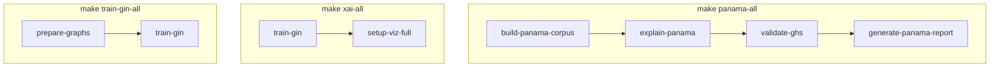

# Scripts por fase

Scripts de línea de comandos organizados según la fase del proyecto en la que se usan.
Todos se ejecutan desde la **raíz del repositorio** (o vía `make`).

## Fase I — Pipeline de datos

| Script | Comando `make` | Descripción |
|--------|----------------|-------------|
| `fase1/prepare_tox21_graphs.py` | `make prepare-graphs` | Tox21 (DeepChem) → `data/processed/graphs_{train,val,test}.pt` |

## Fase II — Baselines

| Script | Comando `make` | Descripción |
|--------|----------------|-------------|
| `fase2/train_baselines.py` | `make train-baselines` | Entrena RF + MLP + SMILES2vec y guarda AUC en `outputs/results/` |

## Fase III — GNN-GIN

| Script | Comando `make` | Descripción |
|--------|----------------|-------------|
| `fase3/train_gin.py` | `make train-gin` | Entrena GNN-GIN con early stopping; guarda `outputs/models/best_gin_model.pt` |

## Fase IV — Explainable AI y visor

| Script | Comando `make` | Descripción |
|--------|----------------|-------------|
| `fase4/build_viz_corpus.py` | `make build-viz-corpus` | Predicciones + XAI pre-computadas → `viz/data/*.json` |
| `fase4/viz_serve.py` | `make viz` | Servidor FastAPI del dashboard interactivo |

## Fase V — Aplicación a Panamá

| Script | Comando `make` | Descripción |
|--------|----------------|-------------|
| `fase5/build_panama_corpus.py` | `make build-panama-corpus` | PubChem → corpus panameño + GHS → `panama_corpus.pt` |
| `fase5/explain_panama.py` | `make explain-panama` | Predicciones multitarea + GNNExplainer + Grad-CAM (omite XAI desalineado con `[SKIP]`) |
| `fase5/validate_ghs.py` | `make validate-ghs` | Correlación predicciones vs etiquetas GHS |
| `fase5/generate_report.py` | `make generate-panama-report` | Reporte interpretado para MIDA/MINSA |

## Pipelines compuestos



```bash
make panama-all
make xai-all
make train-gin-all
```
